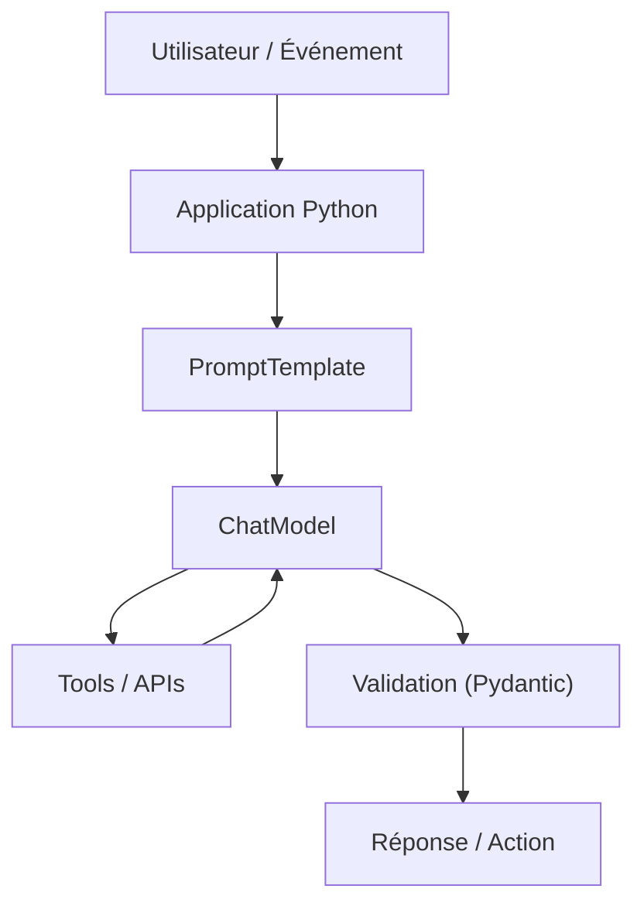

[← Retour au sommaire](../AGentBOOK.md)

## Partie II — Fondamentaux de LangChain

### Chapitre 2 — Architecture de LangChain
Le chapitre précédent expliquait pourquoi un **LLM seul** ne suffit pas en production.  
Ce chapitre introduit **LangChain** comme boîte à outils d'ingénierie pour assembler un système complet : modèle, messages, prompts, outils, validation, observabilité.

#### 2.1 Qu'est-ce que LangChain ?

**LangChain** est un framework Python (et JavaScript) qui structure la construction d'applications basées sur les modèles de langage.

Son rôle principal n'est pas de "remplacer" le modèle, mais de :

- standardiser les appels à plusieurs fournisseurs ;
- structurer les entrées/sorties ;
- composer des briques réutilisables ;
- intégrer facilement tools, RAG, mémoire et garde-fous.

En pratique, LangChain agit comme une **couche d'orchestration applicative** autour du LLM.

#### 2.2 Les principaux composants

Les briques les plus utilisées sont :

- **Models** : interface unifiée vers les modèles (OpenAI, Anthropic, Google, etc.) ;
- **Messages** : format conversationnel (`SystemMessage`, `HumanMessage`, `AIMessage`, `ToolMessage`) ;
- **Prompts** : templates dynamiques pour composer des instructions robustes ;
- **Tools** : fonctions Python appelables par le modèle ;
- **Retrievers** : composants de recherche contextuelle ;
- **Vector stores** : stockage et recherche par similarité ;
- **Agents** : boucle de décision basée sur tools + modèle ;
- **Middleware / Callbacks** : logs, traces, instrumentation, observabilité ;
- **Structured output** : sorties validées (souvent avec Pydantic).

L'intérêt vient de la **composition** de ces briques plutôt que de leur usage isolé.

#### 2.3 Architecture générale d'une application LangChain

Une architecture minimale ressemble à ceci :



Principes d'architecture recommandés :

- garder la logique métier critique hors du prompt ;
- valider toutes les données de sortie importantes ;
- tracer les appels modèle et tools ;
- séparer clairement "raisonnement du modèle" et "action réelle".

#### 2.4 Installation et environnement Python

Exemple d'installation de base :

```bash
pip install -U langchain langchain-openai python-dotenv pydantic
```

Version Python recommandée : **3.10+** (idéalement 3.11+).

Structure minimale d'un projet :

```text
project/
├── app/
│   ├── main.py
│   ├── prompts.py
│   ├── models.py
│   └── tools.py
├── .env
└── requirements.txt
```

#### 2.5 Gestion des variables d'environnement

Ne jamais hardcoder les clés API dans le code.

Fichier `.env` :

```env
OPENAI_API_KEY=sk-...
ANTHROPIC_API_KEY=...
GOOGLE_API_KEY=...
```

Chargement côté Python :

```python
from dotenv import load_dotenv


load_dotenv()
```

Bonnes pratiques :

- stocker les secrets dans l'environnement d'exécution ;
- séparer configuration locale, staging et production ;
- utiliser des permissions minimales sur les clés.

#### 2.6 Premier programme LangChain

Exemple simple avec un modèle de chat :

```python
from langchain_openai import ChatOpenAI
from langchain_core.messages import HumanMessage, SystemMessage


model = ChatOpenAI(model="gpt-4o-mini", temperature=0)

messages = [
    SystemMessage(content="Tu es un assistant expert en architecture IA."),
    HumanMessage(content="Explique en 3 points l'intérêt de LangChain."),
]

response = model.invoke(messages)
print(response.content)
```

Cet exemple montre déjà trois éléments clés :

- messages typés ;
- invocation standardisée (`invoke`) ;
- séparation entre logique applicative et fournisseur du modèle.

#### 2.7 Choisir un fournisseur de modèle

Le choix dépend de plusieurs contraintes :

- qualité de raisonnement ;
- coût par token ;
- latence ;
- capacité de tool calling ;
- fenêtre de contexte ;
- exigences de conformité et de souveraineté.

Options fréquentes :

- **OpenAI** : écosystème mature, excellent support tooling ;
- **Anthropic** : bon équilibre raisonnement/sécurité ;
- **Google** : options multimodales solides ;
- **modèles open source** : flexibilité et maîtrise des coûts d'infra ;
- **modèles locaux** : contrôle maximal des données.

Il est conseillé de comparer les modèles sur **vos cas métier réels**, pas uniquement sur des benchmarks génériques.

#### 2.8 Abstraction des modèles

LangChain permet de garder une interface quasi identique même en changeant de fournisseur.

```python
from langchain_anthropic import ChatAnthropic
from langchain_openai import ChatOpenAI


def get_model(provider: str):
    if provider == "openai":
        return ChatOpenAI(model="gpt-4o-mini", temperature=0)
    if provider == "anthropic":
        return ChatAnthropic(model="claude-3-5-sonnet-latest", temperature=0)
    raise ValueError(f"Provider non supporté: {provider}")
```

Cette abstraction simplifie :

- les tests A/B ;
- les fallbacks ;
- la réduction de dépendance à un vendeur unique.

#### 2.9 Pourquoi éviter de coupler son application à un seul fournisseur

Un couplage fort à un seul provider crée plusieurs risques :

- augmentation unilatérale des coûts ;
- indisponibilité régionale ou incident fournisseur ;
- régressions de qualité sur certaines versions ;
- difficulté de migration.

Une architecture robuste prévoit dès le départ :

- une couche d'abstraction de modèle ;
- des fallbacks par type de tâche ;
- des tests de non-régression multi-modèles ;
- des métriques comparables (coût, latence, qualité).

En résumé : **le modèle est un composant important, mais l'avantage durable vient de l'architecture**.

---

## 🎯 Questions Challenge

> **Question 1** : Quelle est la différence entre intégrer un LLM directement via SDK fournisseur et passer par une couche d'abstraction LangChain ?  
> **Question 2** : Quels critères utiliserais-tu pour sélectionner un modèle dans un cas d'usage retail temps réel ?  
> **Question 3** : Quelle stratégie mettrais-tu en place pour éviter le vendor lock-in dès la première version d'un produit ?
