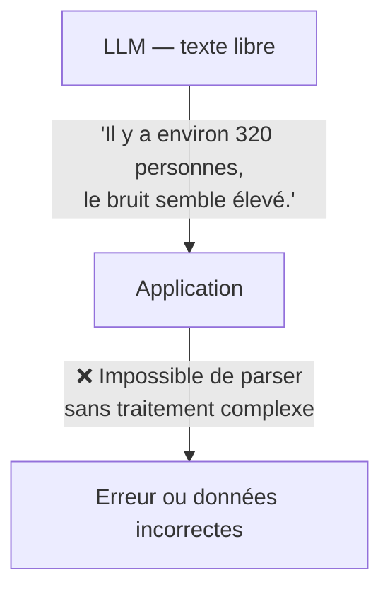
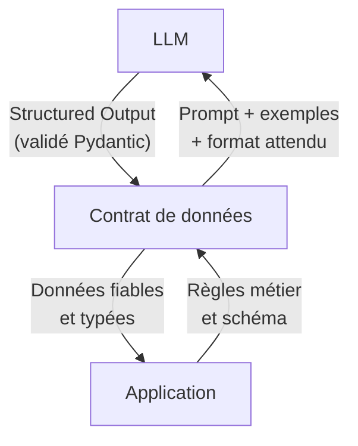

[← Retour au sommaire](../AGentBOOK.md)

## Partie IV — Structured Output

### Chapitre 5 — Faire produire des données fiables au LLM

#### 5.1 Pourquoi le texte libre est insuffisant

Un LLM produit par défaut du texte libre. Cette propriété est précieuse pour la génération de contenu, mais constitue un obstacle majeur lorsqu'une application doit **consommer la sortie programmatiquement**.



Problèmes du texte libre :

- **Format imprévisible** : le modèle peut répondre "320 personnes" ou "environ trois cents vingt personnes"
- **Champs manquants** : le modèle peut omettre des informations attendues
- **Types incorrects** : un nombre peut être écrit en lettres, une date dans n'importe quel format
- **Hallucinations** : le modèle peut inventer des données non présentes dans l'entrée
- **Sensibilité aux variations** : un léger changement de prompt peut produire un format différent

Dans un contexte retail ou de spatial intelligence, une réponse non structurée ne peut pas alimenter un tableau de bord, déclencher une alerte ou alimenter une base de données.

---

#### 5.2 JSON

Le **JSON** est le premier niveau de structuration. On peut demander au modèle de produire une sortie JSON en l'instruisant dans le prompt système, puis parser la réponse.

```python
from langchain_openai import ChatOpenAI
from langchain_core.prompts import ChatPromptTemplate
from langchain_core.output_parsers import JsonOutputParser
import json

llm = ChatOpenAI(model="gpt-4o", temperature=0.0)

template = ChatPromptTemplate.from_messages([
    ("system", """Extrais les données des rapports de capteurs.
Réponds UNIQUEMENT avec un objet JSON valide, sans texte supplémentaire.
Format attendu :
{{
  "zone_id": "string",
  "person_count": integer,
  "noise_db": float,
  "smoke_detected": boolean,
  "alert_required": boolean
}}"""),
    ("human", "{report}"),
])

chain = template | llm | JsonOutputParser()

result = chain.invoke({
    "report": "Caméra Zone_B : 87 personnes présentes, bruit ambiant 79 dB, pas de fumée."
})

print(result)
# {
#     "zone_id": "Zone_B",
#     "person_count": 87,
#     "noise_db": 79.0,
#     "smoke_detected": False,
#     "alert_required": True
# }
```

`JsonOutputParser` parse automatiquement la réponse JSON. Mais cette approche reste fragile : rien ne garantit que le modèle respecte le schéma exact.

---

#### 5.3 Pydantic

**Pydantic** est la solution robuste pour définir et valider des schémas de données en Python. LangChain l'intègre nativement.

```python
from pydantic import BaseModel, Field
from typing import Optional

class CameraEvent(BaseModel):
    """Événement détecté par une caméra de surveillance."""
    zone_id: str = Field(description="Identifiant de la zone surveillée")
    person_count: int = Field(description="Nombre de personnes détectées", ge=0)
    noise_db: float = Field(description="Niveau sonore en décibels", ge=0, le=140)
    smoke_detected: bool = Field(description="Présence de fumée détectée")
    alert_required: bool = Field(description="Une alerte doit-elle être déclenchée")
    alert_reason: Optional[str] = Field(
        default=None,
        description="Raison de l'alerte si alert_required est True",
    )
```

Pydantic valide automatiquement les types, les contraintes (`ge`, `le`, `min_length`...) et les valeurs par défaut. Si le modèle produit un `person_count` négatif ou un `noise_db` de 999, Pydantic lève une `ValidationError`.

---

#### 5.4 Schémas structurés

LangChain permet d'utiliser un modèle Pydantic directement comme schéma de sortie via la méthode `with_structured_output`. C'est la méthode recommandée.

```python
from langchain_openai import ChatOpenAI
from pydantic import BaseModel, Field
from typing import Optional, Literal

class ZoneStatus(BaseModel):
    """Statut opérationnel d'une zone commerciale."""
    zone_id: str = Field(description="Identifiant de la zone")
    status: Literal["normal", "warning", "critical"] = Field(
        description="Statut opérationnel de la zone"
    )
    person_count: int = Field(description="Nombre de personnes estimé", ge=0)
    occupancy_rate: float = Field(
        description="Taux d'occupation en pourcentage", ge=0, le=100
    )
    recommended_action: str = Field(
        description="Action recommandée pour l'équipe terrain"
    )
    priority: int = Field(description="Priorité de 1 (basse) à 5 (critique)", ge=1, le=5)

llm = ChatOpenAI(model="gpt-4o", temperature=0.0)
structured_llm = llm.with_structured_output(ZoneStatus)

result: ZoneStatus = structured_llm.invoke(
    "Zone Caisse : 420 personnes, capacité max 300, 5 caisses ouvertes sur 8."
)

print(result.status)           # "critical"
print(result.occupancy_rate)   # 140.0
print(result.recommended_action)  # "Ouvrir les 3 caisses fermées immédiatement"
```

Le résultat est directement une instance Python valide et typée, pas un dictionnaire brut.

---

#### 5.5 Validation

La validation est la garantie que les données produites par le LLM sont correctes avant d'être utilisées par l'application. Pydantic gère la validation automatiquement, mais il faut aussi gérer les cas d'échec.

```python
from pydantic import BaseModel, Field, field_validator
from typing import Literal

class TrafficAlert(BaseModel):
    """Alerte de trafic générée par l'analyse IA."""
    location: str = Field(description="Localisation de l'alerte")
    severity: Literal["low", "medium", "high", "critical"]
    estimated_impact_minutes: int = Field(ge=0, le=1440)
    affected_zones: list[str] = Field(description="Zones impactées", min_length=1)

    @field_validator("location")
    @classmethod
    def location_not_empty(cls, v: str) -> str:
        if not v.strip():
            raise ValueError("La localisation ne peut pas être vide")
        return v.strip()

    @field_validator("affected_zones")
    @classmethod
    def zones_not_empty(cls, v: list[str]) -> list[str]:
        if not all(zone.strip() for zone in v):
            raise ValueError("Les noms de zones ne peuvent pas être vides")
        return [zone.strip() for zone in v]
```

Ces validateurs personnalisés permettent d'appliquer des règles métier directement au niveau du schéma.

---

#### 5.6 Erreurs de parsing

Même avec `with_structured_output`, des erreurs peuvent survenir. Il faut les anticiper et gérer les cas de repli.

```python
from langchain_openai import ChatOpenAI
from langchain_core.exceptions import OutputParserException
from pydantic import ValidationError

llm = ChatOpenAI(model="gpt-4o", temperature=0.0)
structured_llm = llm.with_structured_output(ZoneStatus)

def safe_structured_invoke(input_text: str) -> ZoneStatus | None:
    try:
        result = structured_llm.invoke(input_text)
        return result
    except OutputParserException as e:
        print(f"Erreur de parsing : {e}")
        # Stratégie de repli : retenter avec un prompt plus explicite
        return retry_with_explicit_prompt(input_text)
    except ValidationError as e:
        print(f"Erreur de validation : {e}")
        return None
    except Exception as e:
        print(f"Erreur inattendue : {e}")
        raise
```

LangChain propose aussi `OutputFixingParser` qui retentera automatiquement l'appel en transmettant l'erreur au modèle pour qu'il corrige sa sortie :

```python
from langchain.output_parsers import OutputFixingParser
from langchain_core.output_parsers import PydanticOutputParser

base_parser = PydanticOutputParser(pydantic_object=ZoneStatus)
fixing_parser = OutputFixingParser.from_llm(parser=base_parser, llm=llm)
```

---

#### 5.7 Structured output

La méthode `with_structured_output` est le standard actuel de LangChain pour produire des sorties structurées. Elle supporte deux modes : **JSON schema** et **function calling**.

```python
# Mode 1 : Pydantic (recommandé)
structured_llm = llm.with_structured_output(ZoneStatus)

# Mode 2 : JSON Schema directement
json_schema = {
    "title": "ZoneStatus",
    "type": "object",
    "properties": {
        "zone_id": {"type": "string"},
        "status": {"type": "string", "enum": ["normal", "warning", "critical"]},
        "person_count": {"type": "integer", "minimum": 0},
    },
    "required": ["zone_id", "status", "person_count"],
}
structured_llm = llm.with_structured_output(json_schema)

# Mode 3 : TypedDict
from typing import TypedDict

class ZoneStatusDict(TypedDict):
    zone_id: str
    status: str
    person_count: int

structured_llm = llm.with_structured_output(ZoneStatusDict)
```

Utilise le mode Pydantic en priorité : il donne la validation, le typage et la documentation automatique des champs.

---

#### 5.8 Extraction d'informations

L'**extraction d'informations** est l'un des cas d'usage les plus courants du structured output : transformer un texte non structuré (rapport, email, message opérateur) en données structurées.

```python
from pydantic import BaseModel, Field
from typing import Optional
from langchain_openai import ChatOpenAI
from langchain_core.prompts import ChatPromptTemplate

class IncidentReport(BaseModel):
    """Rapport d'incident extrait d'un message opérateur."""
    incident_type: str = Field(description="Type d'incident (foule, bruit, sécurité, technique)")
    location: str = Field(description="Localisation de l'incident")
    severity: str = Field(description="Sévérité : low / medium / high / critical")
    person_count_involved: Optional[int] = Field(
        default=None, description="Nombre de personnes impliquées si connu"
    )
    action_required: str = Field(description="Action à prendre")
    notify_security: bool = Field(description="Notifier la sécurité")

llm = ChatOpenAI(model="gpt-4o", temperature=0.0)
structured_llm = llm.with_structured_output(IncidentReport)

template = ChatPromptTemplate.from_messages([
    ("system", "Tu extrais des informations structurées à partir de messages d'opérateurs retail."),
    ("human", "{operator_message}"),
])

chain = template | structured_llm

result = chain.invoke({
    "operator_message": "Grosse affluence au niveau des escalators, environ 200 personnes bloquées, besoin de renfort urgent en zone C niveau 2, les clients commencent à s'énerver."
})

print(result.incident_type)       # "foule"
print(result.severity)            # "high"
print(result.person_count_involved)  # 200
print(result.notify_security)     # True
```

---

#### 5.9 Classification

La **classification** est un autre cas d'usage fondamental : catégoriser une entrée dans un ensemble fini de classes définies.

```python
from pydantic import BaseModel, Field
from typing import Literal
from langchain_openai import ChatOpenAI

class EventClassification(BaseModel):
    """Classification d'un événement détecté par le système de vision."""
    event_type: Literal[
        "crowd_gathering",
        "queue_formation",
        "person_fall",
        "abandoned_object",
        "unauthorized_access",
        "normal_activity",
    ] = Field(description="Type d'événement détecté")
    confidence: float = Field(
        description="Niveau de confiance entre 0 et 1", ge=0.0, le=1.0
    )
    requires_immediate_action: bool = Field(
        description="L'événement nécessite-t-il une action immédiate"
    )
    description: str = Field(description="Description brève de l'événement")

llm = ChatOpenAI(model="gpt-4o", temperature=0.0)
classifier = llm.with_structured_output(EventClassification)

# Classification d'un événement à partir d'une description textuelle
event = classifier.invoke(
    "Caméra 07 détecte une personne allongée sur le sol depuis 45 secondes, "
    "aucun mouvement, d'autres visiteurs commencent à s'arrêter autour."
)

print(event.event_type)                  # "person_fall"
print(event.confidence)                  # 0.95
print(event.requires_immediate_action)   # True
```

Pour les classifieurs à haute fréquence (analyse temps réel), privilégie les modèles rapides (`gpt-4o-mini`) avec une température de 0.0.

---

#### 5.10 Génération d'événements

La **génération d'événements** est le processus par lequel un LLM crée des objets d'événements structurés à partir d'observations, pour les injecter dans un système downstream (base de données, message broker, tableau de bord).

```python
from pydantic import BaseModel, Field
from datetime import datetime
from typing import Literal, Optional
import uuid

class RetailEvent(BaseModel):
    """Événement généré par le système d'analyse IA."""
    event_id: str = Field(
        default_factory=lambda: str(uuid.uuid4()),
        description="Identifiant unique de l'événement"
    )
    timestamp: str = Field(
        default_factory=lambda: datetime.utcnow().isoformat(),
        description="Horodatage ISO 8601"
    )
    site_id: str = Field(description="Identifiant du site")
    zone_id: str = Field(description="Identifiant de la zone")
    event_type: Literal[
        "capacity_exceeded",
        "queue_overflow",
        "anomaly_detected",
        "security_alert",
        "operational_recommendation",
    ]
    severity: Literal["info", "warning", "critical"]
    message: str = Field(description="Message descriptif de l'événement")
    metadata: Optional[dict] = Field(default=None, description="Données supplémentaires")

llm = ChatOpenAI(model="gpt-4o", temperature=0.0)
event_generator = llm.with_structured_output(RetailEvent)

event = event_generator.invoke(
    "Site: MALL_PARIS_03 | Zone: Parking_Nord | "
    "Capacité max: 450 véhicules | Occupancy: 512 véhicules | Heure: 15h30 samedi"
)

print(event.event_type)   # "capacity_exceeded"
print(event.severity)     # "critical"
print(event.event_id)     # UUID unique généré
```

---

#### 5.11 Exemple : événement Computer Vision

Dans un pipeline de spatial intelligence, un modèle de vision par ordinateur produit des détections brutes qu'un LLM peut enrichir et structurer pour les rendre actionnables.

```python
from pydantic import BaseModel, Field
from typing import Literal, Optional

class BoundingBox(BaseModel):
    """Boîte englobante normalisée [x_min, y_min, x_max, y_max]."""
    x_min: float = Field(ge=0.0, le=1.0)
    y_min: float = Field(ge=0.0, le=1.0)
    x_max: float = Field(ge=0.0, le=1.0)
    y_max: float = Field(ge=0.0, le=1.0)

class CVEvent(BaseModel):
    """Événement enrichi issu d'un modèle de Computer Vision."""
    camera_id: str = Field(description="Identifiant de la caméra source")
    event: Literal[
        "person_detected",
        "person_lying",
        "crowd_density_high",
        "intrusion_detected",
        "object_abandoned",
    ] = Field(description="Type d'événement détecté")
    confidence: float = Field(description="Score de confiance [0-1]", ge=0.0, le=1.0)
    bbox: Optional[BoundingBox] = Field(
        default=None, description="Zone de détection dans l'image"
    )
    person_count: Optional[int] = Field(
        default=None, description="Nombre de personnes si applicable", ge=0
    )
    requires_alert: bool = Field(description="Déclencher une alerte opérationnelle")
    alert_message: Optional[str] = Field(
        default=None, description="Message d'alerte si requires_alert est True"
    )

# Exemple de sortie pour une détection de chute
cv_event_example = CVEvent(
    camera_id="CAM_MALL_B2_07",
    event="person_lying",
    confidence=0.92,
    bbox=BoundingBox(x_min=0.31, y_min=0.21, x_max=0.68, y_max=0.82),
    person_count=1,
    requires_alert=True,
    alert_message="Personne allongée détectée en zone B2, intervention médicale requise.",
)

# Chaîne complète : analyse LLM → enrichissement → CVEvent structuré
llm = ChatOpenAI(model="gpt-4o", temperature=0.0)
cv_chain = (
    ChatPromptTemplate.from_messages([
        ("system", """Tu enrichis les détections brutes d'un système Computer Vision.
À partir des données de détection fournies, génère un événement structuré.
Applique les règles métier suivantes :
- person_lying avec confidence > 0.8 → requires_alert = True
- crowd_density_high avec person_count > 50 → requires_alert = True
- intrusion_detected → requires_alert = True
"""),
        ("human", "{detection_data}"),
    ])
    | llm.with_structured_output(CVEvent)
)

result = cv_chain.invoke({
    "detection_data": """
    camera_id: CAM_MALL_B2_07
    raw_detection: person_lying
    confidence_score: 0.92
    bounding_box: [120, 80, 450, 600] (pixels sur image 640x768)
    timestamp: 2024-03-15T14:23:11Z
    """
})
```

Ce pattern est central dans les architectures de spatial intelligence : les modèles de vision produisent des données brutes, le LLM les interprète et génère des événements actionnables pour le système opérationnel.

---

#### 5.12 Concevoir un contrat de données entre IA et application

Un **contrat de données** est la spécification formelle de ce que le LLM doit produire et ce que l'application attend de recevoir. C'est l'équivalent d'un contrat d'API, mais pour les sorties de modèle.



Principes pour concevoir un bon contrat :

**1. Définir le schéma avec Pydantic**

```python
from pydantic import BaseModel, Field
from typing import Literal
from datetime import datetime

class OperationalDecision(BaseModel):
    """Décision opérationnelle produite par l'agent IA."""

    # Identification
    decision_id: str = Field(description="Identifiant unique de la décision")
    generated_at: str = Field(description="Horodatage ISO 8601 de génération")

    # Contexte
    site_id: str
    zone_id: str

    # Décision
    action: Literal[
        "open_additional_checkout",
        "deploy_staff_to_zone",
        "trigger_evacuation_protocol",
        "send_notification",
        "log_observation",
        "escalate_to_supervisor",
    ] = Field(description="Action à exécuter")

    # Paramètres
    action_parameters: dict = Field(
        description="Paramètres spécifiques à l'action"
    )

    # Justification
    reasoning: str = Field(description="Justification de la décision en une phrase")
    confidence: float = Field(ge=0.0, le=1.0)

    # Escalade
    requires_human_approval: bool = Field(
        description="La décision nécessite-t-elle une validation humaine"
    )
```

**2. Documenter le contrat**

```python
# Exemple de décision valide (utilisable en test et en documentation)
example_decision = OperationalDecision(
    decision_id="DEC-2024-0342",
    generated_at="2024-03-15T14:23:00Z",
    site_id="MALL_PARIS_03",
    zone_id="ZONE_CAISSE_PRINCIPALE",
    action="open_additional_checkout",
    action_parameters={"checkout_count": 2, "target_wait_time_minutes": 3},
    reasoning="File d'attente > 8 min avec 320 personnes en zone caisse.",
    confidence=0.91,
    requires_human_approval=False,
)
```

**3. Valider en continu**

```python
def validate_and_dispatch(decision: OperationalDecision) -> bool:
    """Valide une décision et l'achemine vers le système d'exécution."""
    # Validation métier supplémentaire
    if decision.action == "trigger_evacuation_protocol":
        if not decision.requires_human_approval:
            raise ValueError("L'évacuation requiert toujours une validation humaine")

    if decision.confidence < 0.7:
        # Faible confiance → escalade automatique
        decision.requires_human_approval = True

    # Dispatch vers le système downstream
    dispatch_to_action_system(decision)
    return True
```

Le contrat de données est le point de jonction entre le monde non déterministe du LLM et le monde déterministe de l'application. Sa conception rigoureuse est l'une des clés d'un système agentique fiable en production.

---

## 🎯 Questions Challenge

> **Question 1** : Tu construis un système d'extraction automatique des incidents à partir des messages radio des agents de sécurité d'un centre commercial. Conçois le schéma Pydantic complet avec les validateurs appropriés.
> **Question 2** : Quelle stratégie adoptes-tu lorsqu'un LLM échoue à produire un output structuré valide deux fois de suite ? Décris le circuit de repli complet.
> **Question 3** : Dans une architecture de spatial intelligence où des événements sont générés toutes les 500 ms par 50 caméras, quelles optimisations dois-tu mettre en place pour le structured output sans dégrader la fiabilité ?
