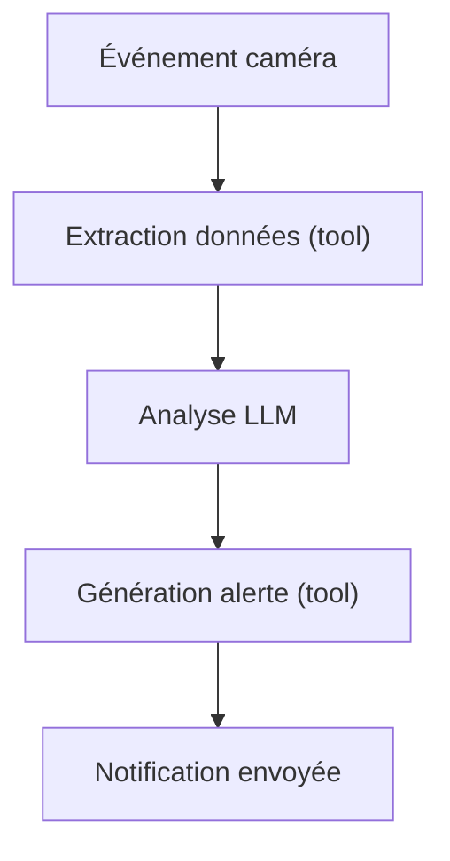
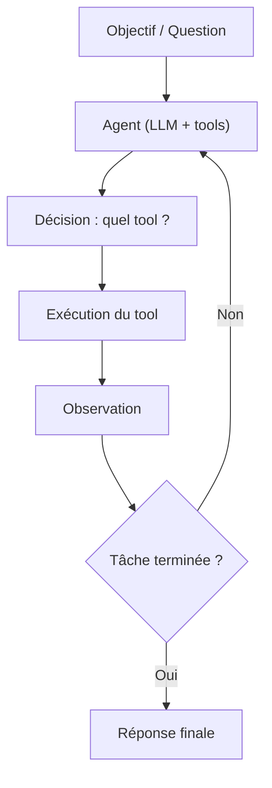
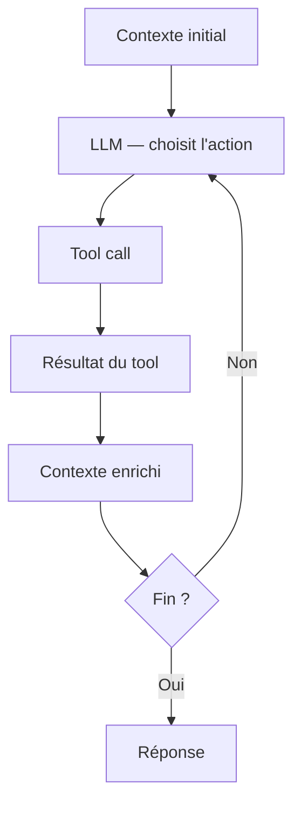
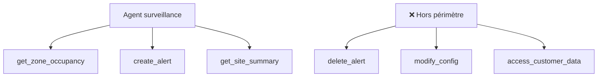
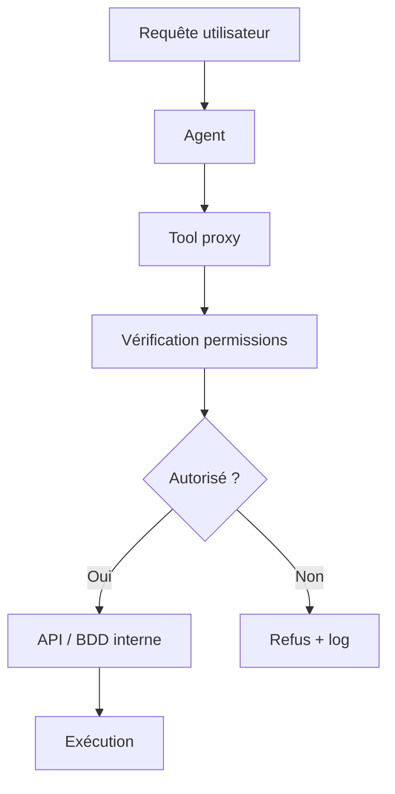
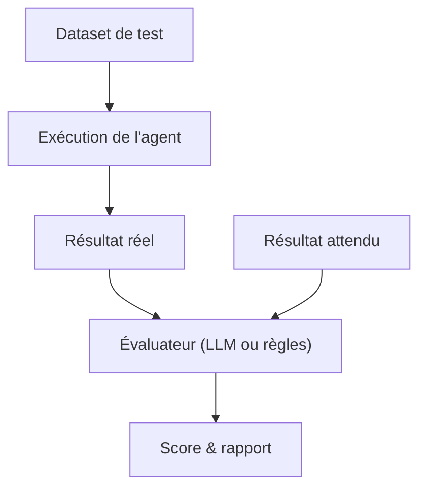

[← Retour au sommaire](../AGentBOOK.md)

## Partie VI — Construire des Agents

### Chapitre 8 — Premier agent

Le chapitre précédent a présenté les tools comme des fonctions que le modèle peut appeler. Ce chapitre franchit l'étape suivante : construire un **agent**, c'est-à-dire un système dans lequel le modèle décide lui-même quand et comment utiliser les tools, dans une boucle d'exécution autonome.

#### 8.1 Workflow classique

Avant d'introduire l'agent, il est utile de rappeler comment fonctionne un workflow classique orienté LLM.

Dans un **workflow déterministe**, l'ordre des étapes est fixé par le développeur :



Ce workflow fonctionne bien quand les étapes sont connues à l'avance. Mais si la séquence doit varier selon le contexte — interroger une API ou une base de données selon la nature de l'événement, par exemple — un agent est plus adapté.

#### 8.2 Agent simple

Un agent dans LangChain, dans sa forme la plus simple, combine un modèle avec une liste de tools. Le modèle décide quelle action effectuer, exécute le tool, observe le résultat, et répète jusqu'à produire une réponse finale.



#### 8.3 Agent executor

LangChain fournit `create_react_agent` et `AgentExecutor` pour construire rapidement ce type de boucle.

```python
from langchain_openai import ChatOpenAI
from langchain.agents import AgentExecutor, create_react_agent
from langchain_core.tools import tool
from langchain import hub


@tool
def get_zone_occupancy(zone_id: str) -> dict:
    """Retourne l'occupation et le bruit d'une zone du magasin."""
    # Simulation d'une API interne
    data = {
        "zone_a": {"count": 87, "noise_db": 74, "threshold": 70},
        "zone_b": {"count": 23, "noise_db": 52, "threshold": 70},
        "caisse": {"count": 142, "noise_db": 81, "threshold": 75},
    }
    return data.get(zone_id.lower(), {"error": "zone inconnue"})


@tool
def create_alert(zone_id: str, reason: str, severity: str) -> str:
    """Crée une alerte dans le système de gestion du site."""
    # En production : appel API ou écriture BDD
    print(f"[ALERT] zone={zone_id} reason={reason} severity={severity}")
    return f"Alerte créée pour {zone_id} : {reason} ({severity})"


tools = [get_zone_occupancy, create_alert]

model = ChatOpenAI(model="gpt-4o", temperature=0)

prompt = hub.pull("hwchase17/react")

agent = create_react_agent(model, tools, prompt)
executor = AgentExecutor(agent=agent, tools=tools, verbose=True)

result = executor.invoke({
    "input": (
        "Vérifie l'occupation de la zone caisse. "
        "Si le bruit dépasse le seuil, crée une alerte de sévérité haute."
    )
})

print(result["output"])
```

#### 8.4 Boucle décision → action → observation

Le cycle fondamental de tout agent est :

1. **Décision** : le modèle lit le contexte et choisit une action.
2. **Action** : le tool est exécuté avec les paramètres choisis.
3. **Observation** : le résultat est ajouté au contexte.
4. **Décision suivante** : le modèle relit le contexte enrichi.



Chaque observation s'ajoute au contexte transmis au modèle. L'agent accumule ainsi les informations jusqu'à produire une réponse finale.

#### 8.5 Arrêt de l'agent

Un agent sans mécanisme d'arrêt peut boucler indéfiniment. LangChain propose plusieurs mécanismes pour contrôler l'arrêt :

- **`AgentFinish`** : signal explicite que l'agent a terminé sa tâche ;
- **`max_iterations`** : nombre maximal d'étapes autorisées ;
- **`max_execution_time`** : timeout global en secondes ;
- **condition de sortie explicite dans le prompt** : formulée comme une instruction.

#### 8.6 Nombre maximal d'itérations

```python
executor = AgentExecutor(
    agent=agent,
    tools=tools,
    max_iterations=10,
    max_execution_time=30.0,  # secondes
    verbose=True,
)
```

Si la limite est atteinte, l'agent retourne la meilleure réponse partielle disponible.

#### 8.7 Gestion des erreurs

Un tool peut échouer : indisponibilité d'API, données manquantes, timeout réseau. LangChain propose `handle_tool_errors` :

```python
executor = AgentExecutor(
    agent=agent,
    tools=tools,
    handle_tool_error=True,  # l'agent tente de récupérer l'erreur
    verbose=True,
)
```

Avec `handle_tool_error=True`, une erreur de tool est transmise comme observation au modèle, qui peut décider de retenter avec des paramètres différents ou d'emprunter un chemin alternatif.

Pour des cas plus précis, on peut personnaliser le message d'erreur :

```python
from langchain_core.tools import ToolException


@tool
def get_zone_occupancy(zone_id: str) -> dict:
    """Retourne l'occupation d'une zone."""
    valid_zones = ["zone_a", "zone_b", "caisse"]
    if zone_id.lower() not in valid_zones:
        raise ToolException(
            f"Zone inconnue : '{zone_id}'. "
            f"Zones valides : {valid_zones}"
        )
    # ... logique réelle
    return {"count": 42, "noise_db": 65}
```

#### 8.8 Hallucinations et mauvais tool calls

Un modèle peut produire des tool calls incorrects :

- **paramètre inventé** : valeur qui n'existe pas dans le système ;
- **tool inexistant** : modèle hallucine un nom de tool ;
- **logique incorrecte** : enchaînement erroné des actions.

Stratégies de mitigation :

- utiliser le **Structured Output** pour valider les paramètres ;
- valider explicitement les arguments dans le tool ;
- fournir un **prompt système clair** listant les tools disponibles et leurs usages exacts ;
- ajouter des exemples few-shot dans le prompt.

#### 8.9 Guardrails

Les guardrails sont des contrôles placés avant ou après l'exécution d'un tool :

```python
from langchain_core.tools import tool


ALLOWED_ZONES = {"zone_a", "zone_b", "caisse", "entree", "reserve"}


@tool
def get_zone_occupancy(zone_id: str) -> dict:
    """Retourne l'occupation d'une zone du magasin."""
    # Guardrail : validation de la zone
    if zone_id.lower() not in ALLOWED_ZONES:
        return {
            "error": f"Zone '{zone_id}' non autorisée.",
            "zones_valides": list(ALLOWED_ZONES),
        }
    # Guardrail : rate limiting simulé
    # En production : vérifier un compteur Redis ou similaire
    return {"zone_id": zone_id, "count": 56, "noise_db": 68}
```

On peut aussi placer des guardrails **au niveau de l'agent**, avant ou après chaque appel LLM.

#### 8.10 Quand ne pas utiliser un agent

Un agent introduit de la latence, de l'imprévisibilité et du coût. Il n'est pas toujours justifié.

| Situation | Architecture recommandée |
|-----------|--------------------------|
| Tâche unique et prévisible | Appel LLM direct |
| Séquence d'étapes connues à l'avance | Workflow déterministe |
| Extraction de données depuis un texte | Structured output |
| Récupération de documents pertinents | RAG simple |
| Décision dynamique sur plusieurs sources | Agent |
| Boucle de décision → action → observation | Agent |

Règle pratique : **commence par le pipeline le plus simple. Ajoute un agent uniquement si un workflow déterministe ne peut pas couvrir tous les cas.**

---

## 🎯 Questions Challenge

> **Question 1** : Quelle est la différence entre un workflow déterministe et un agent dans LangChain ? Donne un exemple concret en contexte retail.
> **Question 2** : Quelles stratégies mettrais-tu en place pour éviter qu'un agent boucle infiniment sur une tâche de monitoring de site ?
> **Question 3** : Décris un cas d'usage dans lequel un agent serait contre-productif par rapport à un simple pipeline.

---

### Chapitre 9 — Concevoir un agent robuste

Construire un agent qui fonctionne en démonstration est simple. Construire un agent qui fonctionne en production, de manière fiable, traçable et contrôlable, est un vrai défi d'ingénierie. Ce chapitre couvre les principes essentiels.

#### 9.1 Définir clairement le rôle de l'agent

Un agent sans rôle précis est un agent dangereux. Avant d'écrire une ligne de code, définis :

- **l'objectif** : que doit accomplir l'agent ?
- **le périmètre** : quelles données peut-il lire ? Quelles actions peut-il effectuer ?
- **les contraintes** : quelles actions sont absolument interdites ?
- **le cas nominal** : comment se déroule le flux le plus courant ?
- **les cas dégradés** : que doit faire l'agent si un tool échoue ?

Exemple pour un agent de surveillance de site retail :

```python
SYSTEM_PROMPT = """
Tu es un agent de surveillance de site retail.

Tes responsabilités :
- Vérifier l'occupation et le bruit des zones sur demande
- Créer des alertes si un seuil est dépassé
- Résumer l'état global du site

Limites absolues :
- Tu ne peux pas modifier les seuils de configuration
- Tu ne peux pas supprimer des alertes
- Tu ne peux pas accéder aux données clients

Si tu ne peux pas accomplir une tâche avec les tools disponibles,
explique pourquoi plutôt que d'inventer une réponse.
"""
```

#### 9.2 Limiter l'espace d'action

Plus l'agent a de tools, plus le risque d'utilisation incorrecte augmente. Ne fournir que les tools **strictement nécessaires** pour la tâche en cours.



#### 9.3 Validation des actions

Avant d'exécuter une action avec effets de bord (écriture, notification, modification), valide toujours les paramètres :

```python
from pydantic import BaseModel, Field, field_validator
from langchain_core.tools import tool


class AlertInput(BaseModel):
    zone_id: str = Field(description="Identifiant de la zone concernée")
    reason: str = Field(description="Raison de l'alerte")
    severity: str = Field(description="Sévérité : low, medium, high, critical")

    @field_validator("severity")
    @classmethod
    def validate_severity(cls, v: str) -> str:
        allowed = {"low", "medium", "high", "critical"}
        if v.lower() not in allowed:
            raise ValueError(f"Sévérité invalide : {v}. Valeurs autorisées : {allowed}")
        return v.lower()

    @field_validator("zone_id")
    @classmethod
    def validate_zone(cls, v: str) -> str:
        allowed = {"zone_a", "zone_b", "caisse", "entree", "reserve"}
        if v.lower() not in allowed:
            raise ValueError(f"Zone invalide : {v}")
        return v.lower()


@tool(args_schema=AlertInput)
def create_alert(zone_id: str, reason: str, severity: str) -> str:
    """Crée une alerte dans le système de gestion du site."""
    print(f"[ALERT] zone={zone_id} | reason={reason} | severity={severity}")
    return f"Alerte {severity} créée pour {zone_id} : {reason}"
```

#### 9.4 Permissions

Un agent de production doit fonctionner sous un **principe de moindre privilège** : ne donner que les permissions strictement nécessaires.

Architecture recommandée :



#### 9.5 Budget d'exécution

Définir des limites explicites sur les ressources consommées :

```python
executor = AgentExecutor(
    agent=agent,
    tools=tools,
    max_iterations=15,          # Nombre maximum de tours
    max_execution_time=60.0,    # Timeout total en secondes
    early_stopping_method="generate",  # Génère une réponse partielle si timeout
    verbose=True,
)
```

#### 9.6 Limite de tokens

Un agent qui boucle accumule du contexte à chaque itération. Sans contrôle, la fenêtre de contexte se remplit, puis l'appel échoue ou coûte très cher.

Stratégies :

- **tronquer l'historique** : ne conserver que les N derniers échanges ;
- **résumer périodiquement** : condenser l'historique en un résumé ;
- **streaming** : traiter les résultats au fil de l'eau sans accumuler inutilement.

#### 9.7 Timeout

En plus du timeout global de l'agent, ajouter un timeout sur chaque appel tool individuel :

```python
import asyncio
from langchain_core.tools import tool


@tool
async def get_external_api_data(endpoint: str) -> dict:
    """Interroge une API externe avec timeout."""
    try:
        async with asyncio.timeout(5.0):  # 5 secondes max
            # ... appel API réel
            return {"status": "ok", "data": {}}
    except asyncio.TimeoutError:
        return {"error": "timeout", "endpoint": endpoint}
```

#### 9.8 Maximum d'itérations

Chaque itération de l'agent coûte au moins un appel LLM. 10 itérations × 1000 tokens = 10 000 tokens minimum. En production :

- définir `max_iterations` selon le coût acceptable par requête ;
- monitorer le nombre moyen d'itérations ;
- alerter si la moyenne dépasse un seuil.

#### 9.9 Détection des boucles infinies

Un agent peut se retrouver à appeler le même tool avec les mêmes paramètres indéfiniment. Stratégies de détection :

```python
from collections import Counter


class LoopDetector:
    """Détecte les boucles dans les appels d'outils de l'agent."""

    def __init__(self, max_repeats: int = 3):
        self.max_repeats = max_repeats
        self.call_counter: Counter = Counter()

    def check(self, tool_name: str, args_key: str) -> bool:
        """Retourne True si une boucle est détectée."""
        key = f"{tool_name}:{args_key}"
        self.call_counter[key] += 1
        return self.call_counter[key] >= self.max_repeats
```

#### 9.10 Observabilité

Un agent sans traces est une boîte noire inutilisable en production. Intégrer LangSmith dès le début :

```python
import os


os.environ["LANGCHAIN_TRACING_V2"] = "true"
os.environ["LANGCHAIN_PROJECT"] = "retail-surveillance-agent"
# LANGCHAIN_API_KEY doit être dans .env
```

Chaque trace capture :
- les messages échangés avec le modèle ;
- les tool calls et leurs résultats ;
- la latence par étape ;
- le nombre de tokens consommés.

#### 9.11 Évaluation

Un agent de production doit être évalué régulièrement sur un **dataset de test** représentatif des cas réels :

- **trajectoire** : l'agent a-t-il emprunté le bon chemin d'outils ?
- **résultat final** : la réponse est-elle correcte ?
- **sécurité** : l'agent a-t-il respecté ses limites ?
- **efficacité** : combien d'itérations pour atteindre le résultat ?



---

## 🎯 Questions Challenge

> **Question 1** : Quelles sont les trois premières mesures que tu prendrais pour rendre un agent de surveillance retail fiable en production ?
> **Question 2** : Comment détecter qu'un agent boucle sur un outil sans modifier le code de l'agent lui-même ?
> **Question 3** : Décris la différence entre `max_iterations` et `max_execution_time` et dans quels cas privilégier l'un ou l'autre.

---
