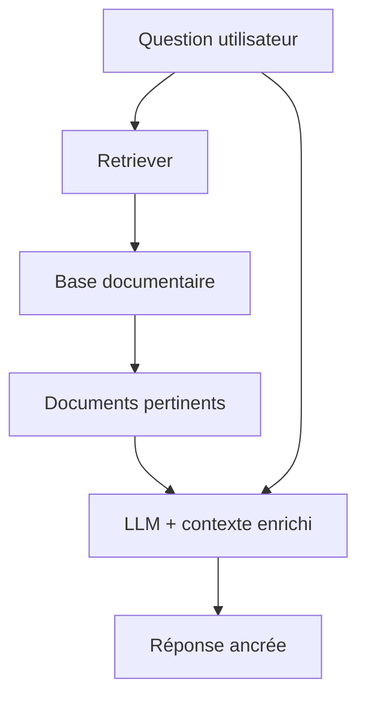
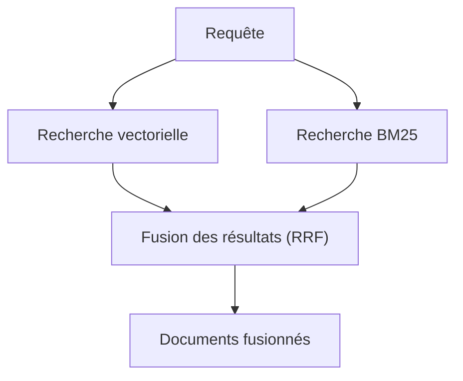
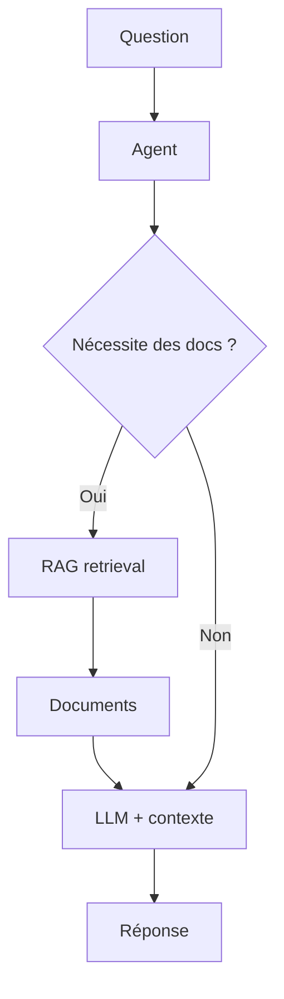
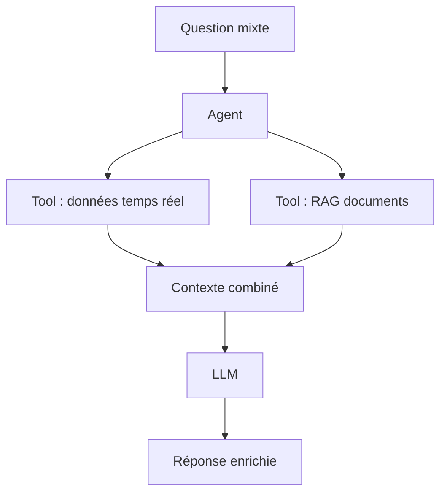

[← Retour au sommaire](../AGentBOOK.md)

## Partie VII — RAG avec LangChain

### Chapitre 10 — Comprendre le RAG

Un LLM a une connaissance figée au moment de son entraînement. Il ne connaît pas vos données métier, vos plans de site, vos fiches produits ni vos historiques d'alertes. Le **RAG** (Retrieval-Augmented Generation) résout ce problème en permettant au modèle de consulter dynamiquement une base de connaissances externe.

#### 10.1 Pourquoi utiliser le RAG

Sans RAG, le modèle ne peut répondre qu'à partir de sa connaissance d'entraînement. Avec le RAG :



Cas d'usage typiques en retail et spatial intelligence :
- recherche dans une base de plans de site ;
- consultation de fiches produit ;
- interrogation de règlements de sécurité ;
- accès à l'historique d'incidents ;
- analyse de rapports d'affluence.

#### 10.2 Knowledge base

La **knowledge base** est la source de vérité externe. Elle peut contenir :
- des documents PDF (plans, règlements, rapports) ;
- des pages web internes ;
- des bases de données structurées ;
- des notes opérationnelles.

#### 10.3 Documents

Dans LangChain, un `Document` est une unité d'information indexable :

```python
from langchain_core.documents import Document


doc = Document(
    page_content=(
        "La zone caisse du site Lyon-Part-Dieu dispose de 12 postes. "
        "Le seuil d'alerte sonore est de 75 dB. "
        "En cas de dépassement, alerter le responsable de caisse."
    ),
    metadata={
        "site": "lyon_part_dieu",
        "zone": "caisse",
        "type": "configuration",
        "version": "2025-01",
    },
)
```

Les **métadonnées** sont clés : elles permettent le filtrage contextuel lors du retrieval.

#### 10.4 Document loaders

LangChain propose des loaders pour de nombreux formats :

```python
from langchain_community.document_loaders import (
    PyPDFLoader,
    TextLoader,
    CSVLoader,
    JSONLoader,
)


# Chargement d'un plan de site PDF
loader = PyPDFLoader("plans/site_lyon.pdf")
docs = loader.load()

# Chargement de logs CSV d'occupation
loader_csv = CSVLoader(
    file_path="data/occupancy_logs.csv",
    metadata_columns=["site_id", "zone_id", "date"],
)
docs_csv = loader_csv.load()
```

#### 10.5 Chunking

Un document entier est souvent trop long pour être transmis au modèle. Le **chunking** le divise en fragments exploitables.

```python
from langchain_text_splitters import RecursiveCharacterTextSplitter


splitter = RecursiveCharacterTextSplitter(
    chunk_size=500,
    chunk_overlap=50,
    separators=["\n\n", "\n", ". ", " ", ""],
)

chunks = splitter.split_documents(docs)
print(f"{len(chunks)} fragments créés")
```

Stratégies de chunking :
- **taille fixe** : simple mais peut couper des phrases importantes ;
- **sémantique** : respect des frontières naturelles du texte ;
- **par section** : idéal pour les documents structurés.

#### 10.6 Embeddings

Les **embeddings** transforment un texte en vecteur numérique capturant sa signification sémantique.

```python
from langchain_openai import OpenAIEmbeddings


embeddings = OpenAIEmbeddings(model="text-embedding-3-small")

# Exemple de transformation
vector = embeddings.embed_query("affluence caisse en heure de pointe")
print(f"Dimension du vecteur : {len(vector)}")
# Dimension du vecteur : 1536
```

Deux textes sémantiquement proches auront des vecteurs proches dans l'espace vectoriel.

#### 10.7 Vector stores

Un **vector store** stocke les embeddings et permet la recherche par similarité.

```python
from langchain_community.vectorstores import FAISS
from langchain_openai import OpenAIEmbeddings


embeddings = OpenAIEmbeddings(model="text-embedding-3-small")

# Création de l'index
vector_store = FAISS.from_documents(chunks, embeddings)

# Sauvegarde locale
vector_store.save_local("indexes/site_knowledge")

# Rechargement
vector_store = FAISS.load_local(
    "indexes/site_knowledge",
    embeddings,
    allow_dangerous_deserialization=True,
)
```

Options courantes :
- **FAISS** : rapide, local, adapté aux prototypes ;
- **Chroma** : persistant, simple à déployer ;
- **Pinecone** : cloud managé, scalable ;
- **pgvector** : extension PostgreSQL, idéale si tu as déjà Postgres.

#### 10.8 Similarity search

```python
# Recherche des 4 fragments les plus pertinents
results = vector_store.similarity_search(
    query="seuil sonore zone caisse",
    k=4,
    filter={"site": "lyon_part_dieu"},  # Filtrage par métadonnée
)

for doc in results:
    print(doc.page_content)
    print(doc.metadata)
```

#### 10.9 Retriever

Un `Retriever` est l'interface standard de recherche dans LangChain :

```python
retriever = vector_store.as_retriever(
    search_type="similarity",
    search_kwargs={"k": 4},
)

docs = retriever.invoke("procédure en cas de bruit excessif")
```

#### 10.10 Génération augmentée par récupération

La chaîne RAG complète :

```python
from langchain_openai import ChatOpenAI
from langchain_core.prompts import ChatPromptTemplate
from langchain_core.output_parsers import StrOutputParser
from langchain_core.runnables import RunnablePassthrough


model = ChatOpenAI(model="gpt-4o-mini", temperature=0)

prompt = ChatPromptTemplate.from_template(
    """Tu es un assistant expert en gestion de site retail.
Utilise uniquement les informations ci-dessous pour répondre.
Si l'information n'est pas disponible, dis-le clairement.

Contexte :
{context}

Question : {question}
"""
)

rag_chain = (
    {
        "context": retriever,
        "question": RunnablePassthrough(),
    }
    | prompt
    | model
    | StrOutputParser()
)

response = rag_chain.invoke("Quel est le seuil sonore de la zone caisse à Lyon ?")
print(response)
```

---

## 🎯 Questions Challenge

> **Question 1** : Pourquoi la qualité du chunking a-t-elle autant d'impact sur la qualité des réponses RAG ?
> **Question 2** : Quelles métadonnées inclurais-tu dans les documents d'un système RAG pour un site retail multisite ?
> **Question 3** : Dans quel cas précis préférerais-tu `pgvector` à FAISS pour un système de production ?

---

### Chapitre 11 — Construire un RAG complet

Ce chapitre guide la construction d'un pipeline RAG complet et robuste, de l'ingestion des données jusqu'à la génération de réponses citées.

#### 11.1 Ingestion

L'ingestion est la phase de collecte des documents sources. En production, elle doit être automatisée et incrémentale.

```python
import os
from pathlib import Path
from langchain_community.document_loaders import (
    PyPDFLoader,
    TextLoader,
    CSVLoader,
)
from langchain_core.documents import Document
from typing import List


def load_site_documents(data_dir: str) -> List[Document]:
    """Charge tous les documents d'un répertoire de site."""
    docs: List[Document] = []
    data_path = Path(data_dir)

    for pdf_file in data_path.glob("**/*.pdf"):
        loader = PyPDFLoader(str(pdf_file))
        docs.extend(loader.load())

    for txt_file in data_path.glob("**/*.txt"):
        loader = TextLoader(str(txt_file), encoding="utf-8")
        docs.extend(loader.load())

    for csv_file in data_path.glob("**/*.csv"):
        loader = CSVLoader(file_path=str(csv_file))
        docs.extend(loader.load())

    print(f"{len(docs)} documents chargés depuis {data_dir}")
    return docs
```

#### 11.2 Nettoyage

Avant d'indexer, nettoyer les documents pour améliorer la qualité du retrieval :

```python
import re
from langchain_core.documents import Document
from typing import List


def clean_documents(docs: List[Document]) -> List[Document]:
    """Nettoie les documents : espaces, caractères parasites, pages vides."""
    cleaned = []
    for doc in docs:
        content = doc.page_content
        # Supprimer les espaces multiples
        content = re.sub(r"\s+", " ", content).strip()
        # Ignorer les pages quasi-vides
        if len(content) < 50:
            continue
        cleaned.append(Document(page_content=content, metadata=doc.metadata))
    return cleaned
```

#### 11.3 Chunking

Pour un système retail, un chunking sémantique par section est souvent préférable au chunking par taille fixe :

```python
from langchain_text_splitters import RecursiveCharacterTextSplitter


def chunk_documents(docs, chunk_size=600, chunk_overlap=80):
    """Découpe les documents en fragments avec recouvrement."""
    splitter = RecursiveCharacterTextSplitter(
        chunk_size=chunk_size,
        chunk_overlap=chunk_overlap,
        separators=["\n\n", "\n", ". ", "! ", "? ", " ", ""],
        add_start_index=True,
    )
    chunks = splitter.split_documents(docs)
    print(f"{len(chunks)} fragments générés")
    return chunks
```

#### 11.4 Embedding

```python
from langchain_openai import OpenAIEmbeddings


def get_embeddings():
    """Retourne le modèle d'embedding configuré."""
    return OpenAIEmbeddings(
        model="text-embedding-3-small",
        dimensions=1536,
    )
```

#### 11.5 Indexation

```python
from langchain_community.vectorstores import FAISS


def build_index(chunks, embeddings, index_path: str):
    """Construit et sauvegarde l'index vectoriel."""
    vector_store = FAISS.from_documents(chunks, embeddings)
    vector_store.save_local(index_path)
    print(f"Index sauvegardé dans {index_path}")
    return vector_store


def load_index(index_path: str, embeddings):
    """Charge un index vectoriel existant."""
    return FAISS.load_local(
        index_path,
        embeddings,
        allow_dangerous_deserialization=True,
    )
```

#### 11.6 Retrieval

```python
def get_retriever(vector_store, k: int = 4, site_id: str = None):
    """Retourne un retriever configuré avec filtrage optionnel."""
    search_kwargs = {"k": k}
    if site_id:
        search_kwargs["filter"] = {"site_id": site_id}

    return vector_store.as_retriever(
        search_type="similarity_score_threshold",
        search_kwargs={**search_kwargs, "score_threshold": 0.7},
    )
```

#### 11.7 Reranking

Le reranking améliore la pertinence en réordonnant les résultats du retrieval :

```python
from langchain.retrievers import ContextualCompressionRetriever
from langchain.retrievers.document_compressors import CrossEncoderReranker
from langchain_community.cross_encoders import HuggingFaceCrossEncoder


model = HuggingFaceCrossEncoder(model_name="BAAI/bge-reranker-base")
compressor = CrossEncoderReranker(model=model, top_n=3)

compression_retriever = ContextualCompressionRetriever(
    base_compressor=compressor,
    base_retriever=get_retriever(vector_store),
)
```

#### 11.8 Context assembly

Avant de transmettre les documents récupérés au modèle, les assembler de manière structurée :

```python
from langchain_core.documents import Document
from typing import List


def format_context(docs: List[Document]) -> str:
    """Formate les documents récupérés en contexte structuré."""
    parts = []
    for i, doc in enumerate(docs, 1):
        meta = doc.metadata
        source = meta.get("source", "inconnue")
        zone = meta.get("zone", "")
        header = f"[Source {i} — {source}"
        if zone:
            header += f" — Zone : {zone}"
        header += "]"
        parts.append(f"{header}\n{doc.page_content}")
    return "\n\n---\n\n".join(parts)
```

#### 11.9 Génération

```python
from langchain_openai import ChatOpenAI
from langchain_core.prompts import ChatPromptTemplate
from langchain_core.output_parsers import StrOutputParser
from langchain_core.runnables import RunnablePassthrough, RunnableLambda


model = ChatOpenAI(model="gpt-4o", temperature=0)

prompt = ChatPromptTemplate.from_template(
    """Tu es un assistant expert en gestion de site retail.
Réponds uniquement à partir des sources fournies.
Si l'information est absente des sources, indique-le explicitement.

Sources :
{context}

Question : {question}

Réponse (cite les sources utilisées) :
"""
)

rag_chain = (
    {
        "context": retriever | RunnableLambda(format_context),
        "question": RunnablePassthrough(),
    }
    | prompt
    | model
    | StrOutputParser()
)
```

#### 11.10 Citations

Pour forcer des citations structurées, utiliser le Structured Output :

```python
from pydantic import BaseModel, Field
from typing import List
from langchain_openai import ChatOpenAI


class RAGResponse(BaseModel):
    answer: str = Field(description="Réponse à la question")
    sources: List[str] = Field(description="Identifiants des sources utilisées")
    confidence: str = Field(description="Niveau de confiance : high, medium, low")


model = ChatOpenAI(model="gpt-4o", temperature=0)
structured_model = model.with_structured_output(RAGResponse)
```

#### 11.11 Évaluation du retrieval

Métriques clés :

- **Recall@k** : proportion de documents pertinents récupérés parmi les k premiers ;
- **Precision@k** : proportion de documents pertinents parmi les k résultats ;
- **MRR** (Mean Reciprocal Rank) : position moyenne du premier document pertinent.

```python
def recall_at_k(retrieved_ids: list, relevant_ids: list, k: int) -> float:
    """Calcule le recall@k."""
    retrieved_k = set(retrieved_ids[:k])
    relevant = set(relevant_ids)
    if not relevant:
        return 0.0
    return len(retrieved_k & relevant) / len(relevant)
```

#### 11.12 Évaluation de la réponse

Utiliser un LLM comme juge :

```python
from langchain_openai import ChatOpenAI
from langchain_core.prompts import ChatPromptTemplate
from pydantic import BaseModel, Field


class RAGEvaluation(BaseModel):
    faithfulness: int = Field(description="La réponse est-elle fidèle aux sources ? 1-5")
    relevance: int = Field(description="La réponse répond-elle à la question ? 1-5")
    comment: str = Field(description="Commentaire d'évaluation")


eval_model = ChatOpenAI(model="gpt-4o", temperature=0)
eval_model_structured = eval_model.with_structured_output(RAGEvaluation)

eval_prompt = ChatPromptTemplate.from_template(
    """Évalue cette réponse RAG.

Question : {question}
Sources fournies : {context}
Réponse générée : {answer}

Évalue la fidélité aux sources (faithfulness) et la pertinence (relevance) sur 5.
"""
)

eval_chain = eval_prompt | eval_model_structured
```

---

## 🎯 Questions Challenge

> **Question 1** : Quelle stratégie de chunking choisirais-tu pour indexer les fiches de configuration d'un réseau de 200 sites retail ?
> **Question 2** : Pourquoi le reranking améliore-t-il la qualité des réponses par rapport à un simple `similarity_search` ?
> **Question 3** : Décris comment mesurer la qualité d'un système RAG sur un jeu de données de questions/réponses issu de l'opérationnel.

---

### Chapitre 12 — RAG avancé

Un RAG de base fonctionne bien sur des questions simples. Pour des cas d'usage complexes — questions multi-aspects, données hétérogènes, sources mixtes — des techniques avancées sont nécessaires.

#### 12.1 Hybrid search

La recherche hybride combine la recherche vectorielle (sémantique) et la recherche par mots-clés (BM25) pour une meilleure couverture :



```python
from langchain_community.retrievers import BM25Retriever
from langchain.retrievers import EnsembleRetriever


bm25_retriever = BM25Retriever.from_documents(chunks)
bm25_retriever.k = 4

vector_retriever = vector_store.as_retriever(search_kwargs={"k": 4})

ensemble_retriever = EnsembleRetriever(
    retrievers=[bm25_retriever, vector_retriever],
    weights=[0.4, 0.6],  # 40% BM25, 60% vectoriel
)

docs = ensemble_retriever.invoke("seuil alerte caisse lyon")
```

#### 12.2 Metadata filtering

Filtrer les documents par métadonnées avant la recherche sémantique réduit le bruit et améliore la précision :

```python
# Retriever filtré sur un site spécifique
retriever_lyon = vector_store.as_retriever(
    search_kwargs={
        "k": 4,
        "filter": {
            "site_id": "lyon_part_dieu",
            "type": "configuration",
        },
    }
)
```

Modèle de métadonnées recommandé pour un RAG retail :

```python
metadata = {
    "site_id": "lyon_part_dieu",
    "zone_id": "caisse",
    "document_type": "configuration",  # configuration, incident, rapport, reglementation
    "date": "2025-01-15",
    "version": "v3.2",
    "region": "aura",
}
```

#### 12.3 Multi-query retrieval

Une seule formulation de requête peut manquer des documents pertinents. Le multi-query génère plusieurs variantes :

```python
from langchain.retrievers.multi_query import MultiQueryRetriever
from langchain_openai import ChatOpenAI


llm = ChatOpenAI(model="gpt-4o-mini", temperature=0.3)

multi_query_retriever = MultiQueryRetriever.from_llm(
    retriever=vector_retriever,
    llm=llm,
)

# Génère automatiquement plusieurs variantes de la question
docs = multi_query_retriever.invoke(
    "que faire si le bruit dépasse le seuil en zone caisse ?"
)
```

#### 12.4 Query rewriting

Reformuler la requête pour améliorer le retrieval :

```python
from langchain_openai import ChatOpenAI
from langchain_core.prompts import ChatPromptTemplate
from langchain_core.output_parsers import StrOutputParser


rewrite_prompt = ChatPromptTemplate.from_template(
    """Tu es un expert en recherche documentaire pour des sites retail.
Reformule cette question pour maximiser la récupération de documents pertinents.
Rends la requête plus précise, technique si nécessaire.

Question originale : {question}
Question reformulée :"""
)

rewrite_chain = (
    rewrite_prompt
    | ChatOpenAI(model="gpt-4o-mini", temperature=0)
    | StrOutputParser()
)

rewritten = rewrite_chain.invoke({"question": "problème bruit caisse"})
# → "Procédure de gestion d'un dépassement de seuil sonore en zone caisse"
```

#### 12.5 Parent-child retrieval

Indexer des petits fragments (précision) mais retourner leurs parents (contexte) :

```python
from langchain.retrievers import ParentDocumentRetriever
from langchain.storage import InMemoryStore
from langchain_text_splitters import RecursiveCharacterTextSplitter
from langchain_community.vectorstores import FAISS
from langchain_openai import OpenAIEmbeddings


parent_splitter = RecursiveCharacterTextSplitter(chunk_size=2000)
child_splitter = RecursiveCharacterTextSplitter(chunk_size=400)

vectorstore = FAISS.from_documents([], OpenAIEmbeddings())
store = InMemoryStore()

retriever = ParentDocumentRetriever(
    vectorstore=vectorstore,
    docstore=store,
    child_splitter=child_splitter,
    parent_splitter=parent_splitter,
)

retriever.add_documents(docs)
```

#### 12.6 Reranking

Voir 11.7. En production, préférer un reranker léger (cross-encoder local) pour limiter la latence.

#### 12.7 Context compression

Compresser le contexte pour n'en conserver que la partie pertinente à la question :

```python
from langchain.retrievers import ContextualCompressionRetriever
from langchain.retrievers.document_compressors import LLMChainExtractor
from langchain_openai import ChatOpenAI


compressor = LLMChainExtractor.from_llm(
    ChatOpenAI(model="gpt-4o-mini", temperature=0)
)

compression_retriever = ContextualCompressionRetriever(
    base_compressor=compressor,
    base_retriever=vector_retriever,
)
```

#### 12.8 Agentic RAG

Au lieu d'un pipeline fixe, laisser un agent décider quand et comment récupérer de l'information :



```python
from langchain_core.tools import tool


@tool
def search_site_knowledge(query: str, site_id: str = None) -> str:
    """
    Recherche dans la base de connaissances du site.
    Utilise pour toute question sur les configurations, procédures ou incidents.
    """
    retriever = get_retriever(vector_store, k=4, site_id=site_id)
    docs = retriever.invoke(query)
    return format_context(docs)
```

#### 12.9 RAG avec tools

Combiner RAG et tools pour des requêtes mixtes (données temps réel + connaissances documentaires) :



#### 12.10 Quand préférer une base SQL à un vector store

| Cas d'usage | Recommandation |
|-------------|----------------|
| Données structurées, requêtes précises | SQL |
| Recherche par similarité sémantique | Vector store |
| Questions analytiques (agrégats, filtres) | SQL |
| Recherche de documents par sens | Vector store |
| Historique d'événements avec timestamps | SQL |
| Base de connaissances non structurée | Vector store |
| Les deux (hybride) | SQL + Vector store |

---

## 🎯 Questions Challenge

> **Question 1** : Décris une architecture RAG hybride pour un agent capable de répondre à la fois sur des données temps réel (capteurs) et des documents de configuration.
> **Question 2** : Dans quel cas le multi-query retrieval apporte-t-il le plus de valeur ?
> **Question 3** : Quand préférer le parent-child retrieval par rapport au chunking standard ?

---
