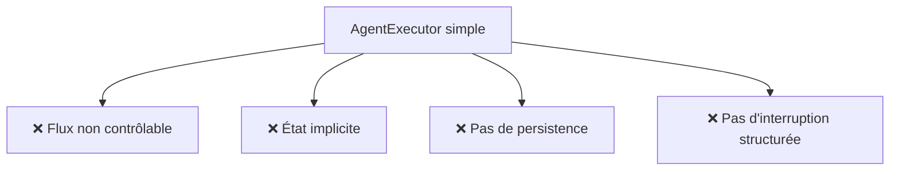
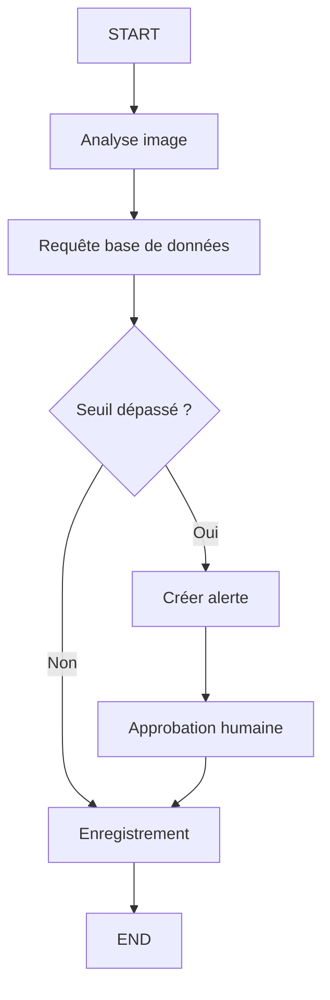
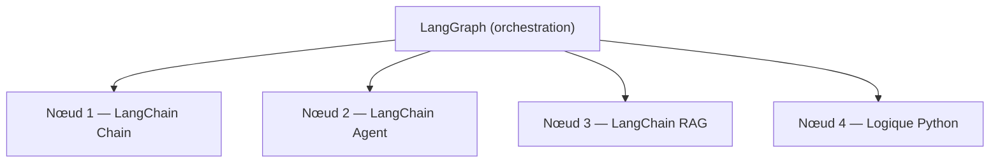
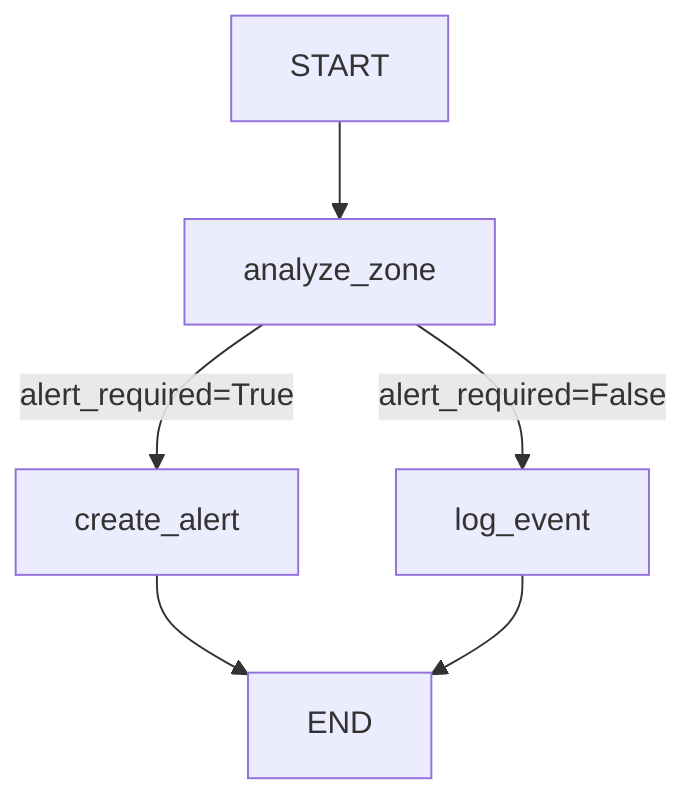

[← Retour au sommaire](../AGentBOOK.md)

## Partie VIII — LangGraph

### Chapitre 13 — Pourquoi LangGraph ?

LangChain suffit pour construire des agents simples. Mais dès qu'un workflow agentique devient complexe — plusieurs branches de décision, plusieurs agents, états persistants, approbations humaines — un cadre plus structuré devient nécessaire. C'est le rôle de **LangGraph**.

#### 13.1 Limites des agents simples

Un `AgentExecutor` classique présente des limites importantes en production :

- **pas de contrôle fin du flux** : on ne peut pas forcer certains nœuds ou certaines transitions ;
- **état implicite** : le contexte est géré en mémoire sans schéma défini ;
- **pas de persistence native** : si le processus s'arrête, l'état est perdu ;
- **pas d'interruption structurée** : impossible de demander une validation humaine à un point précis.



#### 13.2 Workflow complexe

Un système de surveillance retail peut nécessiter :
- une analyse de l'image caméra ;
- une vérification en base de données ;
- une décision conditionnelle (alerte ou non) ;
- une approbation humaine pour les actions critiques ;
- un enregistrement de l'événement.

Ce type de flux ne peut pas être géré proprement avec un agent simple.

#### 13.3 State machine

LangGraph structure les agents comme des **machines à états** : des nœuds de traitement reliés par des transitions explicites.



#### 13.4 Graphes

Dans LangGraph, un graphe est composé de :
- **nœuds** (nodes) : fonctions de traitement ;
- **arêtes** (edges) : transitions entre nœuds ;
- **arêtes conditionnelles** : transitions basées sur l'état ;
- **état partagé** : structure de données commune à tous les nœuds.

#### 13.5 LangGraph comme moteur d'orchestration

LangGraph ne remplace pas LangChain : il l'orchestre. Les nœuds d'un graphe LangGraph utilisent les mêmes composants LangChain (modèles, tools, prompts, retrievers).



#### 13.6 Agent déterministe vs agent dynamique

| Dimension | Agent déterministe | Agent dynamique |
|-----------|-------------------|-----------------|
| Flux | Fixé à l'avance | Décidé par le LLM |
| Contrôle | Total | Partiel |
| Prévisibilité | Haute | Variable |
| Flexibilité | Limitée | Haute |
| Outil recommandé | LangGraph (edges fixes) | LangGraph (conditional edges) |

---

## 🎯 Questions Challenge

> **Question 1** : Cite deux situations concrètes en contexte retail où un `AgentExecutor` serait insuffisant et où LangGraph serait nécessaire.
> **Question 2** : Quelle est la différence fondamentale entre un graphe LangGraph et un pipeline LangChain LCEL ?
> **Question 3** : Pourquoi la notion d'état partagé est-elle centrale dans LangGraph ?

---

### Chapitre 14 — Les fondamentaux de LangGraph

Ce chapitre présente les primitives de LangGraph à travers des exemples orientés retail et spatial intelligence.

#### 14.1 State

Le **state** est la structure de données partagée entre tous les nœuds du graphe. Il est défini avec `TypedDict` ou `dataclass`.

```python
from typing import Annotated, List
from typing_extensions import TypedDict
from langgraph.graph.message import add_messages
from langchain_core.messages import BaseMessage


class SurveillanceState(TypedDict):
    # Historique des messages (réduit par add_messages)
    messages: Annotated[List[BaseMessage], add_messages]
    # Données de la zone surveillée
    zone_id: str
    occupancy: int
    noise_db: float
    # Résultat de l'analyse
    alert_required: bool
    alert_reason: str
    # Validation humaine
    human_approved: bool
```

Chaque nœud reçoit l'état complet et retourne un dictionnaire de mises à jour.

#### 14.2 Nodes

Un nœud est une fonction Python prenant l'état en entrée et retournant un dictionnaire de mises à jour :

```python
from langchain_openai import ChatOpenAI
from langchain_core.messages import HumanMessage


model = ChatOpenAI(model="gpt-4o", temperature=0)


def analyze_zone(state: SurveillanceState) -> dict:
    """Analyse l'état d'une zone et détermine si une alerte est nécessaire."""
    zone_id = state["zone_id"]
    occupancy = state["occupancy"]
    noise_db = state["noise_db"]

    prompt = f"""
    Zone : {zone_id}
    Personnes : {occupancy}
    Bruit : {noise_db} dB
    Seuil bruit : 75 dB

    L'alerte est-elle nécessaire ? Réponds par 'oui' ou 'non' et explique brièvement.
    """

    response = model.invoke([HumanMessage(content=prompt)])

    alert_required = "oui" in response.content.lower()

    return {
        "messages": [response],
        "alert_required": alert_required,
        "alert_reason": response.content,
    }
```

#### 14.3 Edges

Les arêtes définissent les transitions entre nœuds :

```python
from langgraph.graph import StateGraph, START, END


builder = StateGraph(SurveillanceState)

# Ajout des nœuds
builder.add_node("analyze_zone", analyze_zone)
builder.add_node("create_alert", create_alert_node)
builder.add_node("log_event", log_event_node)

# Arêtes fixes
builder.add_edge(START, "analyze_zone")
builder.add_edge("log_event", END)
```

#### 14.4 Conditional edges

Les arêtes conditionnelles permettent un routage dynamique basé sur l'état :

```python
def route_after_analysis(state: SurveillanceState) -> str:
    """Détermine le nœud suivant selon le résultat de l'analyse."""
    if state["alert_required"]:
        return "create_alert"
    return "log_event"


builder.add_conditional_edges(
    "analyze_zone",
    route_after_analysis,
    {
        "create_alert": "create_alert",
        "log_event": "log_event",
    },
)
```

#### 14.5 Start

Le nœud `START` est le point d'entrée du graphe. Il est fourni par LangGraph et désigne le premier nœud à exécuter.

```python
builder.add_edge(START, "analyze_zone")
```

#### 14.6 End

Le nœud `END` signale la fin de l'exécution. Un graphe peut avoir plusieurs chemins vers `END`.

```python
builder.add_edge("log_event", END)
builder.add_edge("create_alert", END)
```

#### 14.7 Compilation du graphe

```python
graph = builder.compile()
```

La compilation valide la structure du graphe et retourne un objet exécutable.

#### 14.8 Invocation

```python
initial_state = {
    "messages": [],
    "zone_id": "caisse",
    "occupancy": 142,
    "noise_db": 82.5,
    "alert_required": False,
    "alert_reason": "",
    "human_approved": False,
}

result = graph.invoke(initial_state)
print(result["alert_required"])
print(result["alert_reason"])
```

#### 14.9 Streaming

LangGraph supporte le streaming des événements de chaque nœud :

```python
for event in graph.stream(initial_state, stream_mode="updates"):
    for node_name, node_output in event.items():
        print(f"[{node_name}] → {node_output}")
```

#### 14.10 Visualisation du graphe

```python
from IPython.display import Image, display


# En Jupyter
display(Image(graph.get_graph().draw_mermaid_png()))

# Obtenir la représentation Mermaid
print(graph.get_graph().draw_mermaid())
```

Exemple de graphe généré :



---

## 🎯 Questions Challenge

> **Question 1** : Quelle est la différence entre une arête fixe et une arête conditionnelle dans LangGraph ?
> **Question 2** : Pourquoi définir l'état avec `TypedDict` plutôt qu'un simple dictionnaire Python ?
> **Question 3** : Dans quel cas utiliserais-tu `stream_mode="updates"` plutôt que `invoke` pour un système de surveillance temps réel ?

---
