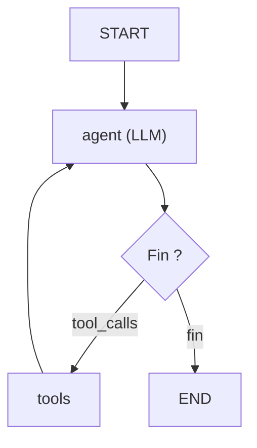

[← Retour au sommaire](../AGentBOOK.md)

## Partie IX — Construire des Agents avec LangGraph

### Chapitre 15 — Agent LangGraph

LangGraph permet de construire des agents avec un contrôle total du flux d'exécution. Ce chapitre construit pas à pas un agent complet, du routing à la gestion des erreurs.

#### 15.1 Architecture

L'architecture d'un agent LangGraph typique combine un nœud LLM, un nœud d'exécution de tools, et des arêtes conditionnelles :



#### LLM

```python
from langchain_openai import ChatOpenAI
from langchain_core.tools import tool


@tool
def get_zone_data(zone_id: str) -> dict:
    """Retourne les données temps réel d'une zone du site."""
    zones = {
        "zone_a": {"count": 87, "noise_db": 74.0, "threshold_noise": 70},
        "caisse": {"count": 142, "noise_db": 81.0, "threshold_noise": 75},
        "entree": {"count": 35, "noise_db": 62.0, "threshold_noise": 80},
    }
    return zones.get(zone_id.lower(), {"error": f"Zone inconnue : {zone_id}"})


@tool
def create_alert(zone_id: str, reason: str, severity: str) -> str:
    """Crée une alerte dans le système de gestion du site."""
    return f"Alerte {severity} créée pour {zone_id} : {reason}"


@tool
def get_site_summary() -> dict:
    """Retourne un résumé de l'état global du site."""
    return {
        "total_zones": 5,
        "zones_in_alert": 2,
        "highest_noise_zone": "caisse",
        "highest_noise_db": 81.0,
    }


tools = [get_zone_data, create_alert, get_site_summary]

model = ChatOpenAI(model="gpt-4o", temperature=0)
model_with_tools = model.bind_tools(tools)
```

#### 15.2 Routing

```python
from typing import Literal
from langchain_core.messages import AIMessage


def should_continue(state: dict) -> Literal["tools", "__end__"]:
    """Détermine si l'agent doit appeler des tools ou terminer."""
    messages = state["messages"]
    last_message = messages[-1]

    if isinstance(last_message, AIMessage) and last_message.tool_calls:
        return "tools"
    return "__end__"
```

#### 15.3 Conditional edges

```python
from langgraph.graph import StateGraph, START, END
from langgraph.prebuilt import ToolNode
from typing import Annotated, List
from typing_extensions import TypedDict
from langgraph.graph.message import add_messages
from langchain_core.messages import BaseMessage


class AgentState(TypedDict):
    messages: Annotated[List[BaseMessage], add_messages]


def call_model(state: AgentState) -> dict:
    """Nœud LLM : appelle le modèle avec l'état courant."""
    messages = state["messages"]
    response = model_with_tools.invoke(messages)
    return {"messages": [response]}


tool_node = ToolNode(tools)

builder = StateGraph(AgentState)
builder.add_node("agent", call_model)
builder.add_node("tools", tool_node)

builder.add_edge(START, "agent")
builder.add_conditional_edges("agent", should_continue)
builder.add_edge("tools", "agent")

graph = builder.compile()
```

#### 15.4 Tool execution

`ToolNode` est un nœud prêt à l'emploi qui exécute tous les tool calls présents dans le dernier message :

```python
from langgraph.prebuilt import ToolNode


tool_node = ToolNode(tools)
```

Pour un comportement plus personnalisé :

```python
from langchain_core.messages import ToolMessage
import json


def custom_tool_node(state: AgentState) -> dict:
    """Nœud d'exécution de tools avec logging."""
    messages = state["messages"]
    last_message = messages[-1]

    tool_results = []
    for tool_call in last_message.tool_calls:
        tool_name = tool_call["name"]
        tool_args = tool_call["args"]

        # Trouver et appeler le bon tool
        matching_tools = [t for t in tools if t.name == tool_name]
        if not matching_tools:
            result = {"error": f"Tool inconnu : {tool_name}"}
        else:
            try:
                result = matching_tools[0].invoke(tool_args)
            except Exception as e:
                result = {"error": str(e)}

        tool_results.append(
            ToolMessage(
                content=json.dumps(result, ensure_ascii=False),
                tool_call_id=tool_call["id"],
            )
        )

    return {"messages": tool_results}
```

#### 15.5 Boucles

La boucle agent ↔ tools s'arrête naturellement quand l'agent produit une réponse sans tool_calls. Pour des cas plus complexes, ajouter un compteur dans l'état :

```python
class AgentStateWithCounter(TypedDict):
    messages: Annotated[List[BaseMessage], add_messages]
    iteration_count: int


def call_model_with_counter(state: AgentStateWithCounter) -> dict:
    """Nœud LLM avec compteur d'itérations."""
    current_count = state.get("iteration_count", 0)
    return {
        "messages": [model_with_tools.invoke(state["messages"])],
        "iteration_count": current_count + 1,
    }


def should_continue_with_limit(state: AgentStateWithCounter) -> str:
    """Arrête après 10 itérations même si non terminé."""
    if state.get("iteration_count", 0) >= 10:
        return "__end__"
    last_message = state["messages"][-1]
    if isinstance(last_message, AIMessage) and last_message.tool_calls:
        return "tools"
    return "__end__"
```

#### 15.6 Arrêt contrôlé

```python
from langchain_core.messages import SystemMessage


SYSTEM_MESSAGE = SystemMessage(content="""
Tu es un agent de surveillance retail.
Quand tu as répondu à la question, termine IMMÉDIATEMENT.
N'appelle pas de tools supplémentaires si la réponse est complète.
""")

result = graph.invoke({
    "messages": [
        SYSTEM_MESSAGE,
        HumanMessage(content="Vérifie la zone caisse et crée une alerte si nécessaire."),
    ]
})
```

#### 15.7 Error recovery

```python
def call_model_with_error_recovery(state: AgentState) -> dict:
    """Nœud LLM avec récupération d'erreur."""
    try:
        response = model_with_tools.invoke(state["messages"])
        return {"messages": [response]}
    except Exception as e:
        # Retour d'un message d'erreur lisible par le graphe
        error_message = AIMessage(
            content=f"Erreur lors de l'appel au modèle : {str(e)}. Arrêt."
        )
        return {"messages": [error_message]}
```

#### 15.8 Retry nodes

```python
import time
from typing import Callable


def with_retry(func: Callable, max_retries: int = 3, delay: float = 1.0):
    """Décorateur de retry pour les nœuds LangGraph."""
    def wrapper(state):
        for attempt in range(max_retries):
            try:
                return func(state)
            except Exception as e:
                if attempt < max_retries - 1:
                    time.sleep(delay * (attempt + 1))
                else:
                    raise
    return wrapper


resilient_call_model = with_retry(call_model, max_retries=3)
builder.add_node("agent", resilient_call_model)
```

#### 15.9 Fallback nodes

```python
from langchain_anthropic import ChatAnthropic


fallback_model = ChatAnthropic(
    model="claude-3-5-sonnet-latest",
    temperature=0,
)
fallback_model_with_tools = fallback_model.bind_tools(tools)


def call_model_with_fallback(state: AgentState) -> dict:
    """Nœud LLM avec fallback sur Anthropic si OpenAI échoue."""
    try:
        response = model_with_tools.invoke(state["messages"])
        return {"messages": [response]}
    except Exception:
        response = fallback_model_with_tools.invoke(state["messages"])
        return {"messages": [response]}
```

#### 15.10 Human approval nodes

```python
from langgraph.checkpoint.memory import MemorySaver
from langgraph.graph import interrupt


def create_alert_with_approval(state: AgentState) -> dict:
    """Nœud qui crée une alerte après approbation humaine."""
    # Extraire les détails de l'alerte depuis les messages
    last_tool_call = state["messages"][-2].tool_calls[-1]
    alert_args = last_tool_call["args"]

    # Interrompre pour demander l'approbation humaine
    decision = interrupt({
        "type": "human_approval",
        "message": (
            f"Créer une alerte {alert_args.get('severity', 'medium')} "
            f"pour {alert_args.get('zone_id')} ? "
            f"Raison : {alert_args.get('reason')}"
        ),
        "alert_details": alert_args,
    })

    if decision.get("approved"):
        result = create_alert.invoke(alert_args)
        return {"messages": [AIMessage(content=f"Alerte créée : {result}")]}
    else:
        return {"messages": [AIMessage(content="Alerte annulée par l'opérateur.")]}


# Compilation avec checkpointer pour supporter les interruptions
checkpointer = MemorySaver()
graph_with_hitl = builder.compile(checkpointer=checkpointer)
```

---

## 🎯 Questions Challenge

> **Question 1** : Explique le rôle du `ToolNode` et dans quel cas tu écrirais un nœud d'exécution de tools personnalisé.
> **Question 2** : Comment garantir qu'un agent LangGraph ne s'exécute pas plus de N fois même si le LLM continue à appeler des tools ?
> **Question 3** : Décris l'architecture d'un agent retail capable de créer des alertes avec validation humaine pour les alertes critiques uniquement.

---
