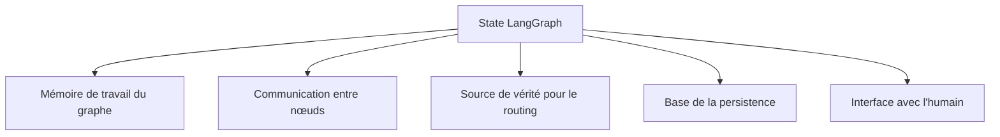
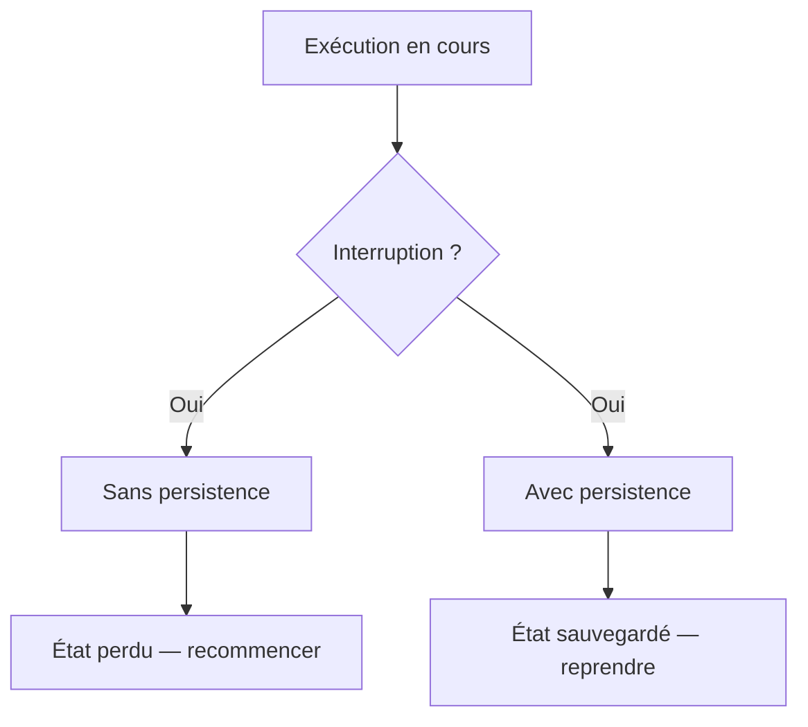
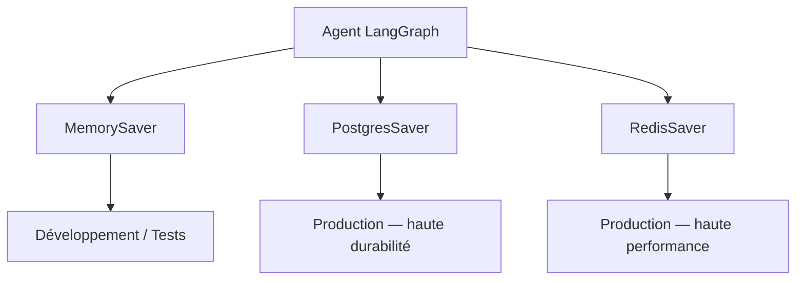

[← Retour au sommaire](../AGentBOOK.md)

## Partie X — State, Mémoire et Persistence

### Chapitre 16 — Concevoir le State

Le **state** est la colonne vertébrale d'un système LangGraph. Bien le concevoir dès le départ évite des refactorisations coûteuses.

#### 16.1 Pourquoi le state est central

Le state remplit plusieurs rôles simultanément :



Un state mal conçu rend le graphe difficile à déboguer, à tester et à faire évoluer.

#### 16.2 State schema

```python
from typing import Annotated, List, Optional
from typing_extensions import TypedDict
from langgraph.graph.message import add_messages
from langchain_core.messages import BaseMessage


class RetailAgentState(TypedDict):
    # --- Conversation ---
    messages: Annotated[List[BaseMessage], add_messages]

    # --- Données métier ---
    site_id: str
    zone_id: Optional[str]
    current_occupancy: Optional[int]
    current_noise_db: Optional[float]

    # --- Résultats d'analyse ---
    alert_required: bool
    alert_severity: Optional[str]
    alert_reason: Optional[str]

    # --- Contrôle de flux ---
    iteration_count: int
    error_count: int
    last_error: Optional[str]

    # --- Persistence ---
    session_id: str
    created_at: str
```

#### 16.3 State updates

Chaque nœud met à jour **uniquement les champs qu'il modifie** :

```python
def analyze_occupancy(state: RetailAgentState) -> dict:
    """Analyse l'occupation et met à jour l'état."""
    occupancy = state["current_occupancy"]
    # ... analyse
    return {
        # Met à jour seulement ces deux champs
        "alert_required": occupancy > 150,
        "alert_reason": f"Occupation élevée : {occupancy} personnes",
    }
```

Les champs non retournés restent inchangés.

#### 16.4 Reducers

Par défaut, une mise à jour remplace la valeur existante. Un **reducer** permet de définir un comportement d'accumulation.

Le reducer `add_messages` est l'exemple le plus courant : il ajoute les nouveaux messages à la liste existante au lieu de la remplacer.

```python
from operator import add
from typing import Annotated


class StateWithAccumulator(TypedDict):
    # Accumulateur : les nouvelles valeurs s'ajoutent à la liste
    alerts: Annotated[List[str], add]
    # Remplacement : la nouvelle valeur écrase l'ancienne
    last_zone_id: str
```

Reducer personnalisé :

```python
from typing import List


def deduplicate_alerts(existing: List[str], new: List[str]) -> List[str]:
    """Reducer qui déduplique les alertes."""
    return list(set(existing + new))


class StateWithDedup(TypedDict):
    alerts: Annotated[List[str], deduplicate_alerts]
```

#### 16.5 État conversationnel

L'état conversationnel maintient l'historique des échanges :

```python
from langchain_core.messages import HumanMessage, AIMessage, SystemMessage

# L'état conversationnel est géré via add_messages
# Chaque nœud ajoute ses messages sans écraser l'historique
```

Pour limiter la taille de l'historique :

```python
from langchain_core.messages import trim_messages


def trim_conversation(state: RetailAgentState) -> dict:
    """Tronque l'historique pour rester dans la fenêtre de contexte."""
    trimmed = trim_messages(
        state["messages"],
        max_tokens=4000,
        token_counter=model,
        strategy="last",
        include_system=True,
    )
    return {"messages": trimmed}
```

#### 16.6 État métier

L'état métier contient les données de domaine spécifiques à l'application :

```python
from pydantic import BaseModel
from typing import Optional


class ZoneSnapshot(BaseModel):
    zone_id: str
    occupancy: int
    noise_db: float
    smoke_detected: bool
    timestamp: str


class RetailBusinessState(TypedDict):
    current_snapshot: Optional[ZoneSnapshot]
    historical_snapshots: List[ZoneSnapshot]
    active_alerts: List[str]
    site_config: dict
```

#### 16.7 État temporaire

Certains champs ne sont nécessaires que pendant l'exécution d'un sous-workflow :

```python
class StateWithTemp(TypedDict):
    # Permanent
    messages: Annotated[List[BaseMessage], add_messages]
    site_id: str
    # Temporaire — à nettoyer après usage
    temp_api_response: Optional[dict]
    temp_raw_data: Optional[str]


def cleanup_temp_state(state: StateWithTemp) -> dict:
    """Nettoie les champs temporaires après usage."""
    return {
        "temp_api_response": None,
        "temp_raw_data": None,
    }
```

#### 16.8 État persistant

Certaines informations doivent survivre entre les sessions. LangGraph gère cela via les checkpoints (voir chapitre 17).

```python
class PersistentRetailState(TypedDict):
    # Persistant entre sessions
    session_id: str
    site_id: str
    alert_history: Annotated[List[dict], add]
    # Non persistant (recalculé à chaque session)
    messages: Annotated[List[BaseMessage], add_messages]
    current_occupancy: Optional[int]
```

---

## 🎯 Questions Challenge

> **Question 1** : Quelle est la différence entre un champ d'état avec reducer `add` et un champ avec remplacement direct ?
> **Question 2** : Comment séparerais-tu l'état conversationnel et l'état métier dans un agent de surveillance retail multi-sites ?
> **Question 3** : Dans quel cas créer un reducer personnalisé plutôt qu'utiliser `add` ou `add_messages` ?

---

### Chapitre 17 — Persistence et Checkpoints

La persistence permet à un agent de retrouver son état après une interruption, une panne ou un redémarrage. C'est une fonctionnalité essentielle pour les systèmes de production.

#### 17.1 Pourquoi persister l'état



Cas concrets :
- timeout d'une validation humaine (l'opérateur répond 2 heures plus tard) ;
- redémarrage du service en production ;
- pause pour traitement asynchrone (rapport nocturne).

#### 17.2 Checkpoints

Un checkpoint est un instantané de l'état à un point donné de l'exécution.

```python
from langgraph.checkpoint.memory import MemorySaver


# Checkpointer en mémoire (développement)
checkpointer = MemorySaver()

graph = builder.compile(checkpointer=checkpointer)
```

Pour la production, utiliser un checkpointer persistant :

```python
# PostgreSQL (production recommandée)
from langgraph.checkpoint.postgres import PostgresSaver
import psycopg


conn = psycopg.connect("******localhost/retail_db")
checkpointer = PostgresSaver(conn)
checkpointer.setup()  # Crée les tables si nécessaire

graph = builder.compile(checkpointer=checkpointer)
```

#### 17.3 Sessions

Chaque exécution est identifiée par un `thread_id`. Le même `thread_id` permet de reprendre la même session.

```python
config = {
    "configurable": {
        "thread_id": "surveillance_session_001",
    }
}

# Première invocation
result = graph.invoke(initial_state, config=config)

# Invocation suivante avec le même thread — reprend l'état sauvegardé
result2 = graph.invoke(
    {"messages": [HumanMessage(content="Mise à jour : 10 personnes supplémentaires en zone caisse")]},
    config=config,
)
```

#### 17.4 Thread identity

```python
import uuid


def create_session_id(site_id: str, operator_id: str) -> str:
    """Génère un identifiant de session déterministe."""
    return f"{site_id}_{operator_id}_{uuid.uuid4().hex[:8]}"


session_id = create_session_id("lyon_part_dieu", "op_42")
config = {"configurable": {"thread_id": session_id}}
```

#### 17.5 Reprendre une tâche interrompue

```python
# L'agent a été interrompu (Human-in-the-loop ou interruption technique)
# Reprendre en fournissant la suite

resume_config = {
    "configurable": {
        "thread_id": "surveillance_session_001",
    }
}

# Fournir la réponse humaine pour reprendre
result = graph.invoke(
    {"messages": [HumanMessage(content="Alerte approuvée, procéder.")]},
    config=resume_config,
)
```

#### 17.6 Recovery après crash

```python
from langgraph.checkpoint.postgres import PostgresSaver


def get_or_create_session(
    graph,
    thread_id: str,
    initial_state: dict,
    config: dict,
) -> dict:
    """
    Reprend une session existante ou en démarre une nouvelle.
    """
    state_snapshot = graph.get_state(config)

    if state_snapshot and state_snapshot.values:
        # Session existante — reprendre
        print(f"Session {thread_id} reprise depuis checkpoint")
        return graph.invoke(None, config=config)
    else:
        # Nouvelle session
        print(f"Nouvelle session {thread_id}")
        return graph.invoke(initial_state, config=config)
```

#### 17.7 Historique des états

```python
# Lister tous les checkpoints d'une session
checkpoints = list(graph.get_state_history(config))

for checkpoint in checkpoints:
    print(f"Step {checkpoint.metadata.get('step')} | "
          f"Nœud : {checkpoint.metadata.get('source')} | "
          f"Alertes actives : {checkpoint.values.get('active_alerts', [])}")
```

#### 17.8 Time travel

LangGraph permet de revenir à un état antérieur et de reprendre l'exécution depuis ce point :

```python
# Obtenir l'historique
history = list(graph.get_state_history(config))

# Reprendre depuis un checkpoint spécifique (time travel)
past_config = history[2].config  # 3e checkpoint dans le passé
result = graph.invoke(
    {"messages": [HumanMessage(content="Reprendre avec données corrigées")]},
    config=past_config,
)
```

#### 17.9 Architecture de persistence



Recommandation :
- **développement** : `MemorySaver` (rapide, sans dépendance) ;
- **staging/production** : `PostgresSaver` si vous avez déjà PostgreSQL ;
- **haute charge** : `RedisSaver` pour la performance.

---

## 🎯 Questions Challenge

> **Question 1** : Décris un scénario de production retail où la persistence LangGraph est indispensable.
> **Question 2** : Quelle est la différence entre un `thread_id` et un `checkpoint_id` dans LangGraph ?
> **Question 3** : Dans quel cas utiliserais-tu le time travel en production plutôt qu'en développement seulement ?

---
