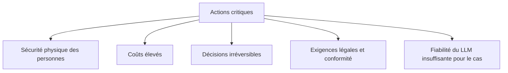
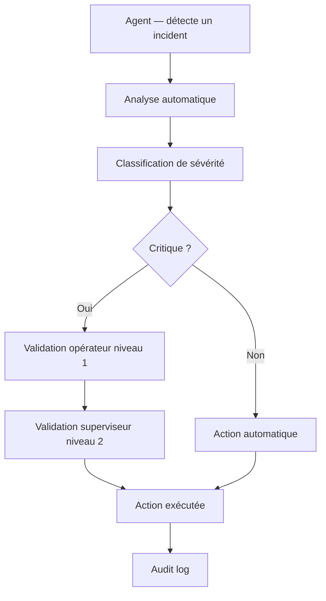

[← Retour au sommaire](../AGentBOOK.md)

## Partie XI — Human-in-the-Loop

### Chapitre 18 — Ajouter un humain dans la boucle

Un agent autonome prend des décisions. Mais certaines décisions — fermer un accès, envoyer une communication d'urgence, modifier une configuration critique — ne doivent pas être prises sans validation humaine. LangGraph intègre ce pattern nativement.

#### 18.1 Pourquoi le Human-in-the-loop

Les raisons d'introduire un humain dans la boucle :



#### 18.2 Interruptions

LangGraph permet d'interrompre l'exécution à n'importe quel nœud et d'attendre une entrée humaine avant de reprendre.

```python
from langgraph.checkpoint.memory import MemorySaver
from langgraph.graph import StateGraph, START, END
from langgraph.graph import interrupt


def approval_node(state: RetailAgentState) -> dict:
    """Nœud d'approbation humaine."""
    # L'exécution s'arrête ici et attend une réponse
    human_input = interrupt({
        "type": "approval_request",
        "message": "Veuillez valider cette action avant de continuer.",
        "context": {
            "zone_id": state.get("zone_id"),
            "alert_severity": state.get("alert_severity"),
            "alert_reason": state.get("alert_reason"),
        },
    })
    return {"human_approved": human_input.get("approved", False)}


checkpointer = MemorySaver()
graph = builder.compile(
    checkpointer=checkpointer,
    interrupt_before=["approval_node"],
)
```

#### 18.3 Validation humaine

```python
# Démarrer l'exécution
config = {"configurable": {"thread_id": "session_abc"}}

result = graph.invoke(initial_state, config=config)
# → L'agent s'arrête avant approval_node

# L'opérateur examine l'état
state = graph.get_state(config)
print(state.values["alert_reason"])  # Affiche la raison de l'alerte

# L'opérateur valide
graph.update_state(
    config,
    values={"human_approved": True},
    as_node="approval_node",
)

# Reprendre l'exécution
result = graph.invoke(None, config=config)
```

#### 18.4 Modification d'une décision

L'opérateur peut modifier l'état avant de reprendre :

```python
# Modifier la sévérité de l'alerte avant approbation
graph.update_state(
    config,
    values={
        "alert_severity": "medium",  # Downgradé de high à medium
        "human_approved": True,
    },
    as_node="approval_node",
)
```

#### 18.5 Reprise du graphe

```python
# Reprendre depuis le point d'interruption
for event in graph.stream(None, config=config):
    for node_name, output in event.items():
        print(f"[{node_name}] {output}")
```

#### 18.6 Approbation d'une action sensible

Architecture complète avec approbation conditionnelle :

```python
from typing import Literal


class AlertState(TypedDict):
    messages: Annotated[List[BaseMessage], add_messages]
    zone_id: str
    alert_severity: str
    alert_reason: str
    human_approved: bool
    action_taken: str


def route_by_severity(state: AlertState) -> Literal["approval_node", "auto_alert"]:
    """Les alertes critiques nécessitent approbation, les autres sont automatiques."""
    severity = state.get("alert_severity", "low")
    if severity in {"critical", "high"}:
        return "approval_node"
    return "auto_alert"


def auto_alert(state: AlertState) -> dict:
    """Crée l'alerte automatiquement (severité basse ou moyenne)."""
    # ... créer l'alerte
    return {"action_taken": f"Alerte {state['alert_severity']} créée automatiquement"}


def approval_node(state: AlertState) -> dict:
    """Attend l'approbation pour les alertes haute/critique."""
    decision = interrupt({
        "question": (
            f"Confirmer l'alerte {state['alert_severity']} pour {state['zone_id']} ?\n"
            f"Raison : {state['alert_reason']}"
        )
    })
    return {"human_approved": decision.get("approved", False)}


def execute_after_approval(state: AlertState) -> dict:
    """Exécute l'alerte après approbation humaine."""
    if state["human_approved"]:
        # ... créer l'alerte
        return {"action_taken": f"Alerte {state['alert_severity']} créée après approbation"}
    return {"action_taken": "Alerte annulée par l'opérateur"}
```

#### 18.7 Exemple : validation avant envoi d'un email

```python
def send_email_node(state: dict) -> dict:
    """Envoie un email de notification après approbation."""
    email_draft = state.get("email_draft", {})

    # Interrompre et afficher le brouillon
    approval = interrupt({
        "type": "email_approval",
        "draft": {
            "to": email_draft.get("to"),
            "subject": email_draft.get("subject"),
            "body": email_draft.get("body"),
        },
        "message": "Valider l'envoi de cet email ?",
    })

    if approval.get("approved"):
        # ... envoyer l'email réel
        return {"email_sent": True, "action_taken": "Email envoyé"}
    return {"email_sent": False, "action_taken": "Email annulé"}
```

#### 18.8 Exemple : validation avant modification d'une base de données

```python
def update_config_node(state: dict) -> dict:
    """Met à jour la configuration d'une zone après approbation humaine."""
    proposed_config = state.get("proposed_config", {})
    current_config = state.get("current_config", {})

    approval = interrupt({
        "type": "config_change",
        "message": f"Modifier la configuration de {state.get('zone_id')} ?",
        "before": current_config,
        "after": proposed_config,
    })

    if approval.get("approved"):
        # ... appliquer le changement en base
        return {
            "current_config": proposed_config,
            "action_taken": "Configuration mise à jour",
        }
    return {"action_taken": "Modification de configuration annulée"}
```

#### 18.9 Human-in-the-loop pour les systèmes critiques

Pour les systèmes critiques (sécurité physique, accès, finances), renforcer avec :



---

## 🎯 Questions Challenge

> **Question 1** : Dans quels cas d'usage retail le Human-in-the-loop est-il juridiquement ou opérationnellement obligatoire ?
> **Question 2** : Comment implémenter une validation à deux niveaux (opérateur + superviseur) dans LangGraph ?
> **Question 3** : Quelle est la différence entre `interrupt_before` et `interrupt_after` lors de la compilation du graphe ?

---
