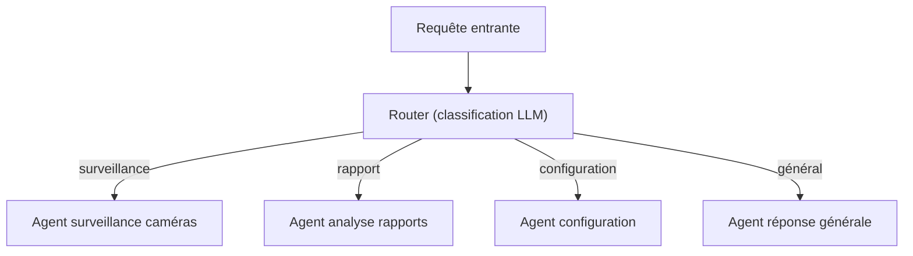
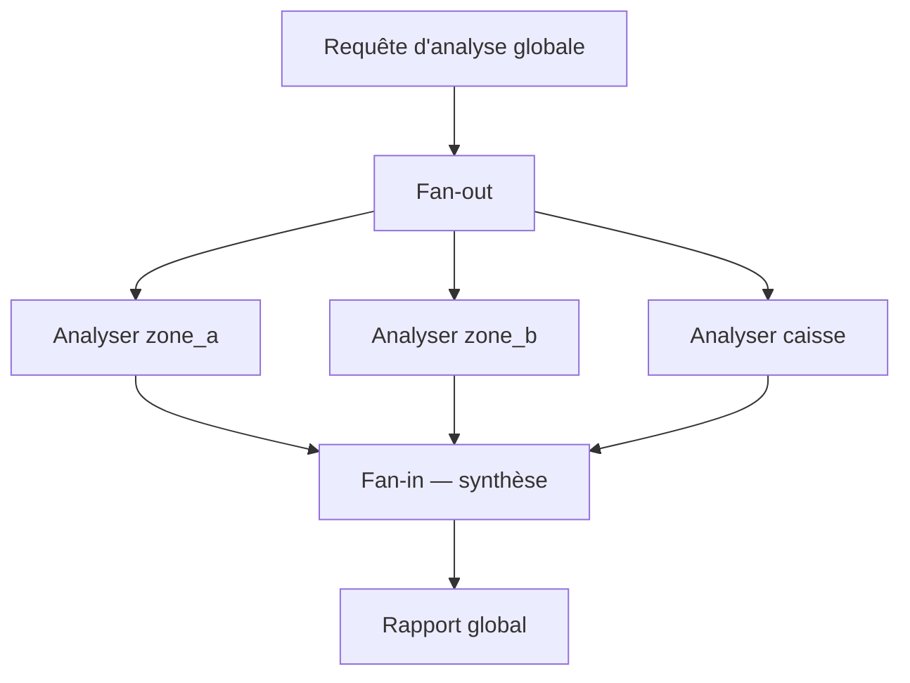
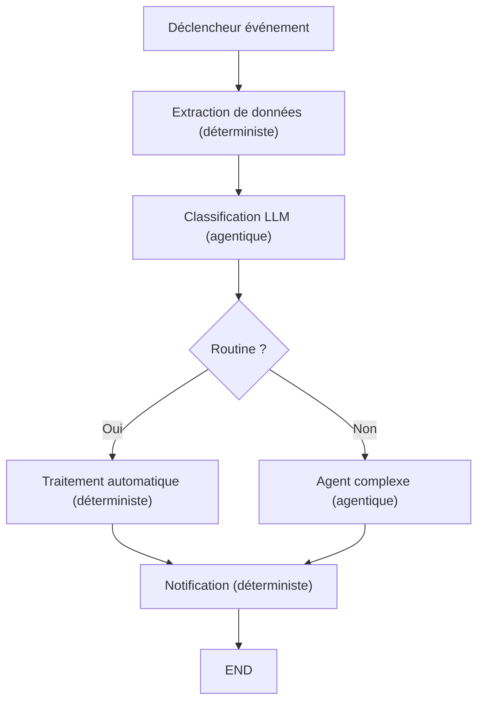
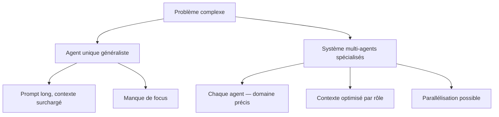
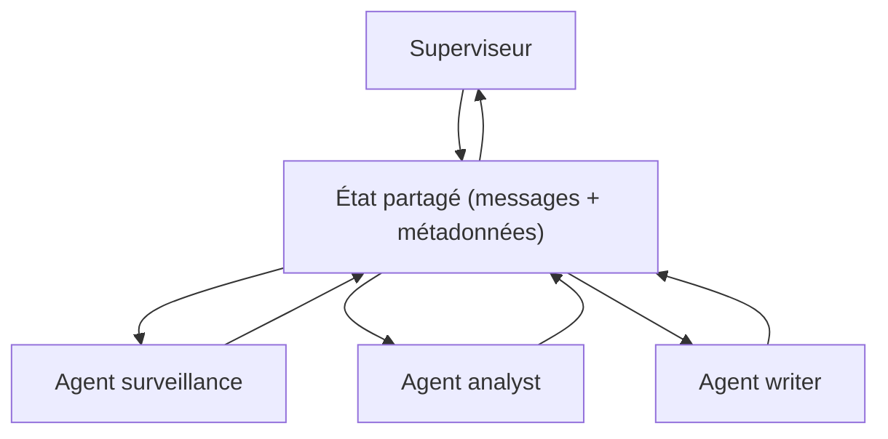
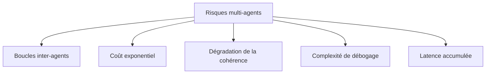

[← Retour au sommaire](../AGentBOOK.md)

## Partie XII — Agents spécialisés et architectures complexes

### Chapitre 19 — Routing et orchestration

Dès qu'un système doit gérer plusieurs types de requêtes, plusieurs sources de données ou plusieurs domaines, le routing et l'orchestration deviennent essentiels.

#### 19.1 Router

Un **router** est un nœud qui analyse une entrée et dirige le flux vers le nœud le plus approprié.



#### 19.2 Classification de requêtes

```python
from pydantic import BaseModel, Field
from typing import Literal
from langchain_openai import ChatOpenAI


class RouteDecision(BaseModel):
    route: Literal["surveillance", "rapport", "configuration", "general"] = Field(
        description="Route choisie selon la nature de la requête"
    )
    confidence: float = Field(description="Niveau de confiance 0-1")
    reasoning: str = Field(description="Justification du choix")


router_model = ChatOpenAI(model="gpt-4o-mini", temperature=0)
structured_router = router_model.with_structured_output(RouteDecision)


def classify_request(state: dict) -> dict:
    """Classifie la requête entrante et détermine la route."""
    user_message = state["messages"][-1].content

    prompt = f"""
    Classifie cette requête retail/spatial intelligence :
    "{user_message}"

    Routes disponibles :
    - surveillance : analyse de caméras, occupation, bruit, alertes temps réel
    - rapport : historiques, analytics, dashboards, exports
    - configuration : seuils, paramètres, zones, permissions
    - general : questions générales, aide, documentation
    """

    decision = structured_router.invoke(prompt)
    return {"route": decision.route, "routing_confidence": decision.confidence}


def route_request(state: dict) -> str:
    """Retourne le nom du nœud cible selon la route."""
    route_map = {
        "surveillance": "surveillance_agent",
        "rapport": "report_agent",
        "configuration": "config_agent",
        "general": "general_agent",
    }
    return route_map.get(state.get("route", "general"), "general_agent")
```

#### 19.3 Dynamic routing

Le routing dynamique permet de changer de route en cours d'exécution selon les découvertes de l'agent :

```python
def dynamic_router(state: dict) -> str:
    """Routage dynamique selon le contexte accumulé."""
    messages = state["messages"]
    last_message = messages[-1]

    # Si une alerte critique a été détectée, passer en mode urgence
    if state.get("alert_severity") == "critical":
        return "emergency_handler"

    # Si l'agent a trouvé des données insuffisantes, demander plus d'infos
    if state.get("data_insufficient"):
        return "data_enrichment"

    # Sinon continuer le flux normal
    return "standard_response"
```

#### 19.4 Parallel execution

LangGraph supporte l'exécution parallèle de plusieurs nœuds :



#### 19.5 Fan-out / fan-in

```python
from typing import List
from langgraph.constants import Send


class MultiZoneState(TypedDict):
    site_id: str
    zones_to_analyze: List[str]
    zone_results: Annotated[List[dict], add]
    global_summary: str


def fan_out_zones(state: MultiZoneState) -> List[Send]:
    """Dispatch l'analyse vers un nœud par zone."""
    return [
        Send("analyze_single_zone", {"zone_id": zone, "site_id": state["site_id"]})
        for zone in state["zones_to_analyze"]
    ]


def analyze_single_zone(state: dict) -> dict:
    """Analyse une zone individuelle."""
    zone_id = state["zone_id"]
    # ... analyse réelle
    return {
        "zone_results": [{"zone_id": zone_id, "status": "ok", "noise_db": 65.0}]
    }


def synthesize_results(state: MultiZoneState) -> dict:
    """Synthétise les résultats de toutes les zones."""
    results = state["zone_results"]
    alerts = [r for r in results if r.get("noise_db", 0) > 75]
    summary = (
        f"{len(results)} zones analysées. "
        f"{len(alerts)} zone(s) en alerte."
    )
    return {"global_summary": summary}


builder_parallel = StateGraph(MultiZoneState)
builder_parallel.add_node("fan_out", fan_out_zones)
builder_parallel.add_node("analyze_single_zone", analyze_single_zone)
builder_parallel.add_node("synthesize_results", synthesize_results)

builder_parallel.add_edge(START, "fan_out")
builder_parallel.add_conditional_edges("fan_out", lambda x: x)
builder_parallel.add_edge("analyze_single_zone", "synthesize_results")
builder_parallel.add_edge("synthesize_results", END)
```

#### 19.6 Subgraphs

Un **subgraph** est un graphe LangGraph complet utilisé comme nœud dans un graphe parent :

```python
# Subgraph : analyse d'une zone
zone_builder = StateGraph(ZoneAnalysisState)
zone_builder.add_node("fetch_data", fetch_zone_data)
zone_builder.add_node("analyze", analyze_zone_data)
zone_builder.add_node("decide_alert", decide_alert)
zone_builder.add_edge(START, "fetch_data")
zone_builder.add_edge("fetch_data", "analyze")
zone_builder.add_edge("analyze", "decide_alert")
zone_builder.add_edge("decide_alert", END)

zone_subgraph = zone_builder.compile()

# Graphe parent : utilise le subgraph comme nœud
site_builder = StateGraph(SiteAnalysisState)
site_builder.add_node("analyze_zone_a", zone_subgraph)
site_builder.add_node("analyze_zone_b", zone_subgraph)
site_builder.add_node("synthesize", synthesize_all_zones)
site_builder.add_edge(START, "analyze_zone_a")
site_builder.add_edge("analyze_zone_a", "analyze_zone_b")
site_builder.add_edge("analyze_zone_b", "synthesize")
site_builder.add_edge("synthesize", END)
```

#### 19.7 Workflows hybrides

Un **workflow hybride** combine des parties déterministes (flux fixe) et des parties agentiques (décision LLM) :



---

## 🎯 Questions Challenge

> **Question 1** : Décris une architecture de routing pour un agent capable de répondre à la fois à des questions de surveillance temps réel et à des questions analytiques sur des historiques.
> **Question 2** : Quels sont les risques d'un fan-out non contrôlé (trop de nœuds parallèles) en production ?
> **Question 3** : Dans quel cas préférerais-tu un subgraph à un simple nœud dans un graphe LangGraph ?

---

### Chapitre 20 — Multi-Agent Systems

Les architectures multi-agents permettent de spécialiser chaque agent sur une tâche précise et de les faire collaborer sous la coordination d'un superviseur.

#### 20.1 Pourquoi plusieurs agents ?



#### 20.2 Agent spécialisé

Chaque agent spécialisé a :
- un prompt système précis définissant son rôle ;
- un ensemble de tools limité à son domaine ;
- une connaissance métier spécifique via RAG ou contexte.

```python
from langchain_openai import ChatOpenAI
from langchain_core.messages import SystemMessage


def create_surveillance_agent(tools: list, model_name: str = "gpt-4o") -> callable:
    """Crée un agent spécialisé en surveillance caméra."""
    model = ChatOpenAI(model=model_name, temperature=0)
    model_with_tools = model.bind_tools(tools)

    system_message = SystemMessage(content="""
    Tu es un agent spécialisé en surveillance de site retail.
    Tu analyses les données de caméras et capteurs en temps réel.
    Tu identifies les situations anormales et proposes des alertes adaptées.
    Tu ne fais rien d'autre — toute autre question doit être redirigée.
    """)

    def agent_node(state: dict) -> dict:
        messages = [system_message] + state["messages"]
        response = model_with_tools.invoke(messages)
        return {"messages": [response]}

    return agent_node
```

#### 20.3 Supervisor

Le **superviseur** orchestre les agents spécialisés : il reçoit la requête, la distribue au bon agent, et synthétise les résultats.

```python
from pydantic import BaseModel, Field
from typing import Literal


AGENTS = ["surveillance_agent", "report_agent", "config_agent"]


class SupervisorDecision(BaseModel):
    next_agent: Literal["surveillance_agent", "report_agent", "config_agent", "FINISH"] = Field(
        description="Prochain agent à appeler, ou FINISH si la tâche est terminée"
    )
    reasoning: str = Field(description="Justification du choix")


supervisor_model = ChatOpenAI(model="gpt-4o", temperature=0)
structured_supervisor = supervisor_model.with_structured_output(SupervisorDecision)


def supervisor_node(state: dict) -> dict:
    """Superviseur : décide quel agent appeler ou si la tâche est terminée."""
    messages = state["messages"]

    prompt = f"""
    Tu es un superviseur d'agents retail.
    Agents disponibles : {AGENTS}

    Historique de la conversation :
    {[m.content for m in messages[-5:]]}

    Quel agent doit agir maintenant ?
    Réponds FINISH si la tâche est complète.
    """

    decision = structured_supervisor.invoke(prompt)
    return {"next_agent": decision.next_agent}


def route_supervisor(state: dict) -> str:
    """Retourne le nom du prochain nœud selon la décision du superviseur."""
    next_agent = state.get("next_agent", "FINISH")
    if next_agent == "FINISH":
        return END
    return next_agent
```

#### 20.4 Agent researcher

```python
def create_researcher_agent(retriever, tools: list) -> callable:
    """Agent chargé de la recherche documentaire."""
    model = ChatOpenAI(model="gpt-4o-mini", temperature=0)

    system_message = SystemMessage(content="""
    Tu es un agent de recherche documentaire spécialisé en retail et spatial intelligence.
    Tu recherches des informations factuelles dans la base de connaissances.
    Tu cites toujours tes sources.
    Tu ne génères pas d'informations que tu ne peux pas sourcer.
    """)

    # Ajouter le RAG comme tool
    @tool
    def search_knowledge(query: str) -> str:
        """Recherche dans la base de connaissances documentaire."""
        docs = retriever.invoke(query)
        return format_context(docs)

    agent_tools = tools + [search_knowledge]
    model_with_tools = model.bind_tools(agent_tools)

    def researcher_node(state: dict) -> dict:
        messages = [system_message] + state["messages"]
        response = model_with_tools.invoke(messages)
        return {"messages": [response]}

    return researcher_node
```

#### 20.5 Agent analyst

```python
def create_analyst_agent(tools: list) -> callable:
    """Agent chargé de l'analyse des données et de la génération d'insights."""
    model = ChatOpenAI(model="gpt-4o", temperature=0)

    system_message = SystemMessage(content="""
    Tu es un agent analyste en intelligence spatiale et retail.
    Tu analyses des données chiffrées : occupation, flux, bruit, incidents.
    Tu produis des insights actionnables et des recommandations précises.
    Tu travailles à partir de données — pas de suppositions.
    """)

    model_with_tools = model.bind_tools(tools)

    def analyst_node(state: dict) -> dict:
        messages = [system_message] + state["messages"]
        response = model_with_tools.invoke(messages)
        return {"messages": [response]}

    return analyst_node
```

#### 20.6 Agent writer

```python
def create_writer_agent() -> callable:
    """Agent chargé de la rédaction de rapports et de communications."""
    model = ChatOpenAI(model="gpt-4o", temperature=0.3)

    system_message = SystemMessage(content="""
    Tu es un agent rédacteur spécialisé en communication retail.
    Tu transformes les analyses en rapports clairs, structurés et actionnables.
    Tu adaptes le niveau de détail selon l'audience (opérateur, manager, direction).
    Tu ne fais pas d'analyse — tu formules uniquement.
    """)

    def writer_node(state: dict) -> dict:
        messages = [system_message] + state["messages"]
        response = model.invoke(messages)
        return {"messages": [response]}

    return writer_node
```

#### 20.7 Agent evaluator

```python
from pydantic import BaseModel, Field


class EvaluationResult(BaseModel):
    quality_score: int = Field(description="Score de qualité 1-5")
    is_sufficient: bool = Field(description="La réponse est-elle suffisante ?")
    missing_elements: list = Field(description="Éléments manquants identifiés")
    recommendation: str = Field(description="Prochaine étape recommandée")


def create_evaluator_agent() -> callable:
    """Agent évaluateur : vérifie la qualité des sorties."""
    model = ChatOpenAI(model="gpt-4o", temperature=0)
    structured_model = model.with_structured_output(EvaluationResult)

    def evaluator_node(state: dict) -> dict:
        last_response = state["messages"][-1].content
        original_request = state["messages"][0].content

        eval_prompt = f"""
        Évalue cette réponse d'agent retail :

        Requête originale : {original_request}
        Réponse produite : {last_response}

        La réponse est-elle complète, précise et actionnable ?
        """

        evaluation = structured_model.invoke(eval_prompt)
        return {
            "evaluation_score": evaluation.quality_score,
            "response_sufficient": evaluation.is_sufficient,
            "messages": [AIMessage(
                content=f"Évaluation : score={evaluation.quality_score}/5 | "
                        f"Suffisant={evaluation.is_sufficient}"
            )],
        }

    return evaluator_node
```

#### 20.8 Communication entre agents

Les agents d'un système multi-agents communiquent via l'état partagé du graphe :



#### 20.9 Shared state

```python
class MultiAgentState(TypedDict):
    # Communication centrale
    messages: Annotated[List[BaseMessage], add_messages]

    # Routing
    next_agent: str

    # Données partagées entre agents
    raw_data: Optional[dict]
    analysis_results: Optional[dict]
    final_report: Optional[str]

    # Métadonnées
    session_id: str
    iteration_count: int
    evaluation_score: Optional[int]
    response_sufficient: bool
```

#### 20.10 Risques des architectures multi-agents



Mitigations :
- définir `max_iterations` au niveau du graphe global ;
- monitorer le coût total par requête ;
- tracer chaque agent individuellement dans LangSmith ;
- tester les chemins critiques avec des jeux de données représentatifs.

#### 20.11 Quand un seul agent est préférable

| Critère | Agent unique | Multi-agents |
|---------|-------------|--------------|
| Domaine unique | ✅ | ❌ surdimensionné |
| Domaines multiples | ❌ contexte surchargé | ✅ |
| Latence critique | ✅ | ❌ latence cumulée |
| Budget limité | ✅ | ❌ coûts multipliés |
| Workflows complexes parallèles | ❌ | ✅ |
| Validation indépendante nécessaire | ❌ | ✅ |

Règle : commencer par un agent unique. Passer au multi-agents uniquement si le contexte de l'agent unique dépasse régulièrement 50% de la fenêtre disponible ou si la qualité baisse sur des sous-domaines distincts.

---

## 🎯 Questions Challenge

> **Question 1** : Décris une architecture multi-agents pour un système de gestion de site retail capable de surveiller des caméras, analyser des historiques et générer des rapports automatiques.
> **Question 2** : Comment éviter les boucles infinies dans un système multi-agents supervisé ?
> **Question 3** : Dans quel cas un agent évaluateur est-il justifié en production plutôt qu'en développement seulement ?
