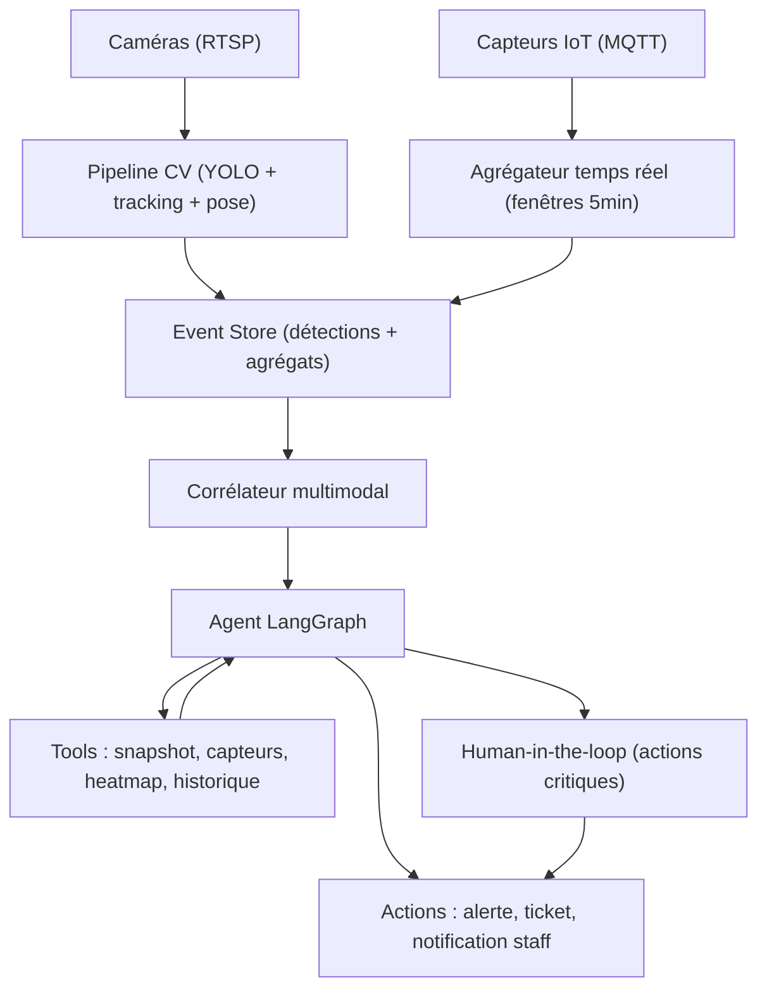

[← Retour au sommaire](../AGentBOOK.md)

## Partie XIII — Agents multimodaux

### Chapitre 21 — Vision, audio et données structurées

Les systèmes de spatial intelligence en retail et en urbanisme ne reposent pas uniquement sur du texte : flux vidéo, capteurs audio, données de computer vision, heatmaps d'occupation, capteurs IoT. Un agent réellement utile doit raisonner sur toutes ces modalités.

#### 21.1 LLM multimodaux

Un **LLM multimodal** accepte plusieurs types d'entrées — texte, image, parfois audio — dans un même message. GPT-4o, Claude et Gemini savent tous analyser des images en plus du texte.

| Modalité | Supportée nativement | Approche alternative |
|----------|---------------------|----------------------|
| Texte | ✅ | — |
| Image | ✅ (GPT-4o, Claude, Gemini) | OCR + description |
| Audio | ⚠️ partiel | Transcription (Whisper) puis texte |
| Vidéo | ⚠️ partiel | Extraction de frames + analyse image |
| Données CV structurées | ❌ | Sérialisation JSON dans le prompt |
| Capteurs IoT | ❌ | Sérialisation JSON dans le prompt |

Principe fondamental : **tout ce qui n'est pas nativement supporté doit être converti en texte ou en image avant d'atteindre le LLM**.

#### 21.2 Images

LangChain permet d'envoyer des images via des messages multimodaux :

```python
import base64

from langchain_core.messages import HumanMessage
from langchain_openai import ChatOpenAI

model = ChatOpenAI(model="gpt-4o")


def encode_image(image_path: str) -> str:
    """Encode une image en base64 pour l'envoi au modèle."""
    with open(image_path, "rb") as f:
        return base64.b64encode(f.read()).decode("utf-8")


image_data = encode_image("frame_zone_caisse.jpg")

message = HumanMessage(
    content=[
        {
            "type": "text",
            "text": (
                "Analyse cette image de caméra de surveillance retail. "
                "Décris : nombre approximatif de personnes, files d'attente, "
                "anomalies visibles (chute, obstruction, comportement inhabituel)."
            ),
        },
        {
            "type": "image_url",
            "image_url": {"url": f"data:image/jpeg;base64,{image_data}"},
        },
    ]
)

response = model.invoke([message])
print(response.content)
```

Bonnes pratiques :
- redimensionner les images avant envoi (les tokens image coûtent cher) ;
- envoyer une image par question précise plutôt que dix images avec une question vague ;
- coupler l'image avec le contexte métier (nom de la zone, heure, seuils).

#### 21.3 Audio

L'audio est généralement traité en deux étapes : transcription puis raisonnement.

```python
from openai import OpenAI

client = OpenAI()


def transcribe_audio(audio_path: str) -> str:
    """Transcrit un fichier audio en texte via Whisper."""
    with open(audio_path, "rb") as f:
        transcript = client.audio.transcriptions.create(
            model="whisper-1",
            file=f,
        )
    return transcript.text


# Cas retail : annonce sonore, bruit anormal capté par un micro de zone
transcription = transcribe_audio("zone_b_audio_sample.wav")

analysis = model.invoke(
    f"Voici une transcription audio captée en Zone B d'un magasin : "
    f"'{transcription}'. Détecte tout signe d'incident (dispute, verre brisé, "
    f"appel à l'aide) et classe la sévérité."
)
```

Pour les données audio non vocales (niveau sonore en dB), inutile de passer par un LLM audio : le capteur fournit déjà une valeur numérique exploitable directement dans le state.

#### 21.4 Vidéo

Aucun LLM grand public ne traite efficacement de longues vidéos brutes. La stratégie standard :

1. **Échantillonner** des frames (1 frame / n secondes ou sur événement CV) ;
2. **Analyser** chaque frame comme une image ;
3. **Agréger** les analyses en une synthèse temporelle.

```python
import cv2


def extract_frames(video_path: str, every_n_seconds: int = 5) -> list[bytes]:
    """Extrait une frame toutes les n secondes d'une vidéo."""
    capture = cv2.VideoCapture(video_path)
    fps = capture.get(cv2.CAP_PROP_FPS)
    interval = int(fps * every_n_seconds)

    frames = []
    index = 0
    while True:
        success, frame = capture.read()
        if not success:
            break
        if index % interval == 0:
            _, buffer = cv2.imencode(".jpg", frame)
            frames.append(buffer.tobytes())
        index += 1

    capture.release()
    return frames
```

Règle de coût : ne jamais envoyer toutes les frames. Utiliser la CV classique (détection de mouvement, tracking) pour **sélectionner** les frames intéressantes, et n'envoyer au LLM que celles-là.

#### 21.5 Données de Computer Vision

Les pipelines CV (YOLO, Detectron, modèles propriétaires) produisent des détections structurées. Le LLM n'a pas besoin de voir l'image : il raisonne sur les **détections sérialisées**.

```python
from pydantic import BaseModel, Field


class Detection(BaseModel):
    """Détection produite par le pipeline CV."""

    label: str = Field(description="Classe détectée : person, cart, spill...")
    confidence: float = Field(ge=0.0, le=1.0)
    bbox: list[float] = Field(description="Bounding box [x1, y1, x2, y2]")
    zone_id: str
    timestamp: str


detections = [
    Detection(
        label="person",
        confidence=0.94,
        bbox=[120.0, 80.0, 210.0, 340.0],
        zone_id="zone_caisse",
        timestamp="2025-01-15T18:42:03Z",
    ),
    Detection(
        label="spill",
        confidence=0.81,
        bbox=[300.0, 400.0, 380.0, 460.0],
        zone_id="zone_caisse",
        timestamp="2025-01-15T18:42:03Z",
    ),
]

prompt = (
    "Voici les détections CV de la zone caisse :\n"
    + "\n".join(d.model_dump_json() for d in detections)
    + "\nY a-t-il un risque nécessitant une intervention ? Justifie."
)
```

Avantages : coût minime (texte seulement), traçabilité complète, testabilité (les détections sont des fixtures reproductibles).

#### 21.6 Pose estimation

La pose estimation (squelettes de points clés) permet de détecter chutes, gestes, postures. Là encore, on transmet au LLM une **interprétation symbolique**, pas les points bruts :

```python
class PoseEvent(BaseModel):
    """Événement de posture dérivé de la pose estimation."""

    person_id: str
    posture: str  # "standing", "sitting", "lying_down", "crouching"
    duration_seconds: float
    zone_id: str


def interpret_pose(keypoints: dict) -> str:
    """Convertit des keypoints bruts en posture symbolique."""
    # Heuristique simplifiée : hanches proches du sol + tronc horizontal
    hip_y = keypoints["hip"]["y"]
    shoulder_y = keypoints["shoulder"]["y"]

    if abs(hip_y - shoulder_y) < 0.1 and hip_y > 0.8:
        return "lying_down"
    if hip_y > 0.6:
        return "crouching"
    return "standing"
```

Un événement `lying_down` de plus de 10 secondes dans une allée devient une alerte de chute potentielle que l'agent doit traiter en priorité.

#### 21.7 Heatmaps

Les heatmaps d'occupation sont l'outil central du retail analytics et de l'urbanisme (flux piétons). Deux façons de les exploiter :

1. **En image** : rendre la heatmap en PNG et l'envoyer à un LLM vision pour une lecture qualitative ;
2. **En données** : sérialiser la grille agrégée par zone — plus fiable et moins coûteux.

```python
heatmap_summary = {
    "site_id": "store_042",
    "period": "2025-01-15T17:00/18:00",
    "zones": [
        {"zone_id": "entree", "avg_density": 0.72, "peak_density": 0.95},
        {"zone_id": "zone_caisse", "avg_density": 0.88, "peak_density": 1.00},
        {"zone_id": "rayon_frais", "avg_density": 0.35, "peak_density": 0.60},
    ],
    "grid_resolution_m": 0.5,
}

prompt = (
    f"Heatmap agrégée du site : {heatmap_summary}. "
    "Identifie les zones de congestion et propose deux actions correctives "
    "(réagencement, ouverture de caisse, signalétique)."
)
```

#### 21.8 Capteurs IoT

Les capteurs (compteurs de passage, sonomètres, température, CO2, portes) produisent des séries temporelles. L'agent consomme des **agrégats**, jamais les points bruts :

```python
class SensorReading(BaseModel):
    """Lecture agrégée d'un capteur IoT."""

    sensor_id: str
    sensor_type: str  # "people_counter", "noise", "co2", "door"
    zone_id: str
    window: str  # ex : "5min"
    value: float
    unit: str
    threshold_exceeded: bool


readings = [
    SensorReading(
        sensor_id="cnt-01",
        sensor_type="people_counter",
        zone_id="entree",
        window="5min",
        value=142.0,
        unit="persons",
        threshold_exceeded=True,
    ),
    SensorReading(
        sensor_id="mic-03",
        sensor_type="noise",
        zone_id="zone_b",
        window="5min",
        value=82.5,
        unit="dB",
        threshold_exceeded=True,
    ),
]
```

Règle d'or : le pré-traitement (fenêtrage, agrégation, comparaison aux seuils) se fait **en amont du LLM**, dans du code déterministe. Le LLM raisonne sur les dépassements, pas sur les mesures.

#### 21.9 Fusion de données

La valeur d'un agent multimodal vient de la **corrélation entre modalités** : une densité élevée (heatmap) + un bruit anormal (capteur) + une détection de chute (CV) dans la même zone au même moment forment un incident, pas trois signaux isolés.

```python
from operator import add
from typing import Annotated, TypedDict


class MultimodalState(TypedDict):
    site_id: str
    cv_events: Annotated[list[dict], add]
    sensor_events: Annotated[list[dict], add]
    audio_events: Annotated[list[dict], add]
    correlated_incidents: list[dict]


def correlate_events(state: MultimodalState) -> dict:
    """Corrèle les événements des modalités par zone et fenêtre temporelle."""
    all_events = (
        state["cv_events"] + state["sensor_events"] + state["audio_events"]
    )

    by_zone: dict[str, list[dict]] = {}
    for event in all_events:
        by_zone.setdefault(event["zone_id"], []).append(event)

    incidents = []
    for zone_id, events in by_zone.items():
        modalities = {e["modality"] for e in events}
        if len(modalities) >= 2:
            incidents.append(
                {
                    "zone_id": zone_id,
                    "modalities": sorted(modalities),
                    "events": events,
                    "severity": "high" if len(modalities) >= 3 else "medium",
                }
            )

    return {"correlated_incidents": incidents}
```

#### 21.10 Agent multimodal

L'agent multimodal orchestre : ingestion par modalité → normalisation → corrélation → raisonnement LLM → action.

```python
from langchain_core.tools import tool
from langgraph.prebuilt import create_react_agent


@tool
def get_camera_snapshot(zone_id: str) -> str:
    """Récupère et analyse la dernière frame caméra d'une zone."""
    # Extraction frame + analyse vision (cf. 21.2)
    return f"Zone {zone_id} : 12 personnes, file de 5 personnes en caisse 2."


@tool
def get_sensor_summary(zone_id: str, window_minutes: int = 5) -> str:
    """Retourne les agrégats capteurs d'une zone sur la fenêtre donnée."""
    return (
        f"Zone {zone_id} ({window_minutes}min) : 142 passages, "
        f"82.5 dB (seuil 75 dépassé), CO2 normal."
    )


@tool
def get_heatmap_summary(site_id: str) -> str:
    """Retourne le résumé de la heatmap d'occupation du site."""
    return "Congestion en zone_caisse (0.88), entrée fluide, rayon frais calme."


multimodal_agent = create_react_agent(
    model="openai:gpt-4o",
    tools=[get_camera_snapshot, get_sensor_summary, get_heatmap_summary],
    prompt=(
        "Tu es un agent de spatial intelligence retail. "
        "Croise systématiquement au moins deux sources (caméra, capteurs, "
        "heatmap) avant de conclure. Toute alerte doit citer ses preuves."
    ),
)
```

#### 21.11 Exemple d'architecture CV + Agent



Points de conception clés :
- **Agent** : le LLM n'intervient qu'après la corrélation — il raisonne sur des incidents candidats, pas sur des flux bruts ;
- **Tools** : chaque tool retourne des données normalisées et bornées en taille ; les tools d'action (notification, ticket) passent par le human-in-the-loop quand la sévérité est critique.

---

## 🎯 Questions Challenge

> **Question 1** : Pourquoi envoie-t-on au LLM des détections CV sérialisées plutôt que les images brutes dans la majorité des cas ? Cite deux exceptions où l'image reste nécessaire.
> **Question 2** : Conçois la logique de fusion pour détecter un mouvement de foule dans un espace urbain à partir de compteurs de passage, d'une heatmap et de l'audio ambiant.
> **Question 3** : Comment limiter le coût d'un agent qui surveille 40 caméras en continu ?
