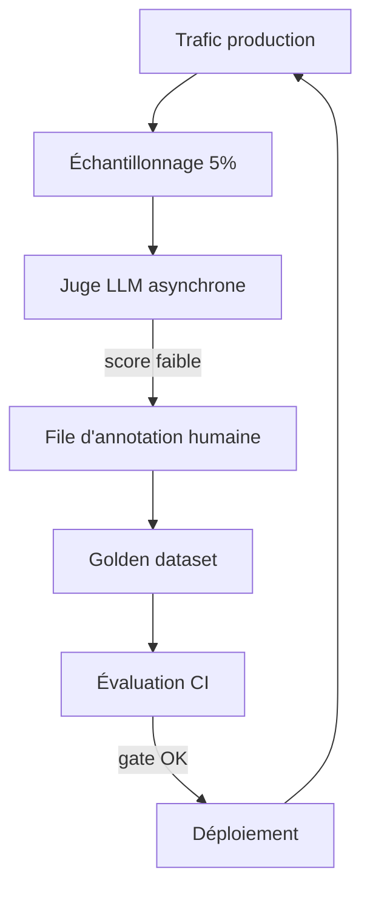

[← Retour au sommaire](../AGentBOOK.md)

## Partie XIV — Observabilité et Evaluation

### Chapitre 22 — Observer un système agentique

Un agent en production sans observabilité est une boîte noire coûteuse. Ce chapitre couvre le tracing, la mesure de latence, de tokens et de coûts, et le debugging.

#### 22.1 Pourquoi les logs classiques sont insuffisants

Un log applicatif classique capture des lignes isolées. Un système agentique produit des **exécutions arborescentes** : une requête déclenche un graphe, chaque nœud peut appeler un LLM, chaque LLM peut appeler des tools, chaque tool peut échouer et être retenté.

| Besoin | Logs classiques | Tracing |
|--------|-----------------|---------|
| Voir le prompt exact envoyé | ❌ tronqué / absent | ✅ |
| Reconstituer la trajectoire de l'agent | ❌ lignes dispersées | ✅ arbre complet |
| Attribuer le coût d'une requête | ❌ | ✅ tokens par appel |
| Comparer deux versions de prompt | ❌ | ✅ |
| Rejouer une exécution qui a échoué | ❌ | ✅ |

#### 22.2 Tracing

**LangSmith** est l'outil de tracing natif de l'écosystème LangChain. Activation par variables d'environnement — aucun changement de code :

```bash
export LANGSMITH_TRACING=true
export LANGSMITH_API_KEY="..."
export LANGSMITH_PROJECT="retail-spatial-agent"
```

Chaque exécution devient une **trace** : un arbre de *runs* (chaîne → LLM → tool → LLM → ...) avec entrées, sorties, latence et tokens à chaque niveau.

Pour tracer du code hors LangChain, utiliser le décorateur `@traceable` :

```python
from langsmith import traceable


@traceable(name="correlate_events", run_type="chain")
def correlate_events(cv_events: list, sensor_events: list) -> list:
    """Corrélation multimodale — visible dans la trace LangSmith."""
    # ... logique de corrélation
    return []
```

#### 22.3 Traçage des appels LLM

Chaque appel LLM tracé expose : le modèle, les messages complets, la réponse, les tokens (input/output), la latence et les tool calls générés. Points à vérifier régulièrement :

- le **system prompt** reçu est-il celui attendu (bonne version) ?
- le contexte injecté (RAG, capteurs) est-il pertinent et borné ?
- le modèle génère-t-il des tool calls valides du premier coup ?

#### 22.4 Traçage des tools

```python
from langchain_core.tools import tool


@tool
def get_zone_history(zone_id: str, hours: int = 24) -> str:
    """Retourne l'historique d'occupation d'une zone."""
    # Le tool est automatiquement tracé : arguments, résultat, durée, erreurs
    ...
```

Métriques clés par tool : taux d'erreur, latence P95, fréquence d'appel, taille des résultats. Un tool appelé 8 fois par requête ou retournant 20 000 tokens est un signal de mauvaise conception.

#### 22.5 Traçage du graphe

Avec LangGraph, la trace montre le chemin réel emprunté dans le graphe : quels nœuds, dans quel ordre, avec quel state en entrée/sortie. On peut aussi streamer les étapes pour un suivi en direct :

```python
for chunk in graph.stream(
    {"messages": [("user", "Analyse la zone caisse")]},
    config={"configurable": {"thread_id": "site-042"}},
    stream_mode="updates",
):
    for node_name, update in chunk.items():
        print(f"[{node_name}] -> {list(update.keys())}")
```

#### 22.6 Latence

La latence d'une requête agentique se décompose : latence LLM (dominante), latence des tools, overhead du graphe. À mesurer :

- **P50 / P95 / P99** par endpoint et par nœud ;
- nombre d'**itérations de boucle agentique** par requête ;
- **time-to-first-token** si vous streamez.

Une dérive de latence vient presque toujours d'une augmentation du nombre d'appels LLM par requête, pas du modèle lui-même.

#### 22.7 Tokens

```python
response = model.invoke("Analyse cette zone...")
usage = response.usage_metadata
# {'input_tokens': 1250, 'output_tokens': 320, 'total_tokens': 1570}
```

Suivre par requête : tokens input (révèle un contexte qui gonfle), tokens output (révèle des réponses trop verbeuses), et le ratio input/output. Un input qui croît au fil d'une conversation signale un historique non tronqué.

#### 22.8 Coût

Le coût se calcule à partir des tokens et du tarif du modèle :

```python
PRICING = {
    "gpt-4o": {"input": 2.50 / 1_000_000, "output": 10.00 / 1_000_000},
    "gpt-4o-mini": {"input": 0.15 / 1_000_000, "output": 0.60 / 1_000_000},
}


def compute_cost(model_name: str, input_tokens: int, output_tokens: int) -> float:
    """Coût en dollars d'un appel LLM."""
    rates = PRICING[model_name]
    return input_tokens * rates["input"] + output_tokens * rates["output"]
```

KPI à suivre : **coût moyen par requête**, coût par site/client, coût des 1% de requêtes les plus chères (souvent des boucles agentiques dégénérées).

#### 22.9 Erreurs

Catégoriser les erreurs pour agir :

| Catégorie | Exemple | Action |
|-----------|---------|--------|
| Erreur fournisseur | rate limit, timeout API | retry + fallback modèle |
| Erreur tool | API capteurs indisponible | retour d'erreur structuré à l'agent |
| Erreur de parsing | sortie structurée invalide | retry avec message d'erreur |
| Erreur logique | boucle infinie, mauvaise route | limite d'itérations + alerte |
| Hallucination | zone inexistante citée | validation des sorties (ch. 26) |

#### 22.10 Debugging d'un agent

Méthode systématique face à un comportement défaillant :

1. **Retrouver la trace** complète de la requête dans LangSmith ;
2. **Localiser la divergence** : premier nœud/appel où la sortie n'est plus celle attendue ;
3. **Inspecter le prompt exact** à ce point (contexte manquant ? instruction ambiguë ?) ;
4. **Rejouer** l'appel isolé dans le playground en modifiant le prompt ;
5. **Transformer le cas en test** de régression avant de corriger.

---

## 🎯 Questions Challenge

> **Question 1** : Une requête « analyse du site » coûte soudainement 4× plus cher qu'avant. Décris ta démarche de diagnostic à partir des traces.
> **Question 2** : Quelles métriques d'observabilité alerteraient sur un agent entré dans une boucle tool-call dégénérée ?
> **Question 3** : Pourquoi le time-to-first-token est-il plus pertinent que la latence totale pour un chatbot de supervision retail ?

### Chapitre 23 — Évaluer un agent

L'évaluation transforme « ça a l'air de marcher » en métriques objectives. Sans elle, chaque changement de prompt ou de modèle est un pari.

#### 23.1 Pourquoi évaluer un agent

Les systèmes agentiques sont non déterministes : le même prompt peut donner des trajectoires différentes. L'évaluation permet de :

- mesurer la qualité **avant** un déploiement (gate de release) ;
- détecter les **régressions** lors d'un changement de prompt, modèle ou tool ;
- comparer objectivement deux architectures (agent unique vs multi-agents) ;
- justifier des choix de coût (gpt-4o-mini suffit-il pour le routing ?).

#### 23.2 Dataset de test

Un dataset d'évaluation est un ensemble de paires (entrée, sortie attendue ou critères) :

```python
from langsmith import Client

client = Client()

dataset = client.create_dataset(
    "retail-agent-eval",
    description="Cas de test de l'agent de spatial intelligence",
)

examples = [
    {
        "inputs": {"question": "Quelle est l'occupation de la zone caisse ?"},
        "outputs": {
            "expected_tool": "get_sensor_summary",
            "must_mention": ["zone_caisse", "occupation"],
        },
    },
    {
        "inputs": {"question": "Une chute a été détectée en zone B, que faire ?"},
        "outputs": {
            "expected_tool": "get_camera_snapshot",
            "must_mention": ["alerte", "intervention"],
            "severity": "high",
        },
    },
]

client.create_examples(dataset_id=dataset.id, examples=examples)
```

Sources des exemples : cas réels anonymisés issus des traces, cas limites imaginés par les experts métier, échecs passés convertis en tests.

#### 23.3 Golden dataset

Le **golden dataset** est le sous-ensemble validé manuellement par des experts, considéré comme la vérité terrain. Règles :

- petit mais irréprochable (50–200 exemples valent mieux que 2 000 douteux) ;
- versionné : chaque modification est revue comme du code ;
- couvrant : cas nominaux, cas limites, cas adverses (prompt injection), cas de refus attendus.

#### 23.4 Evaluation du retrieval

Pour la partie RAG, on évalue le retriever indépendamment du LLM :

```python
def recall_at_k(retrieved_ids: list[str], relevant_ids: list[str], k: int) -> float:
    """Proportion de documents pertinents retrouvés dans le top-k."""
    top_k = set(retrieved_ids[:k])
    relevant = set(relevant_ids)
    if not relevant:
        return 1.0
    return len(top_k & relevant) / len(relevant)
```

Métriques standard : recall@k, precision@k, MRR. Un mauvais retrieval plafonne la qualité finale quel que soit le modèle — l'évaluer en premier.

#### 23.5 Evaluation du tool calling

On vérifie que l'agent appelle le **bon tool** avec les **bons arguments** :

```python
def evaluate_tool_selection(run, example) -> dict:
    """Vérifie que le tool attendu a été appelé."""
    expected_tool = example.outputs["expected_tool"]
    called_tools = [
        tc["name"]
        for msg in run.outputs["messages"]
        for tc in getattr(msg, "tool_calls", [])
    ]
    return {
        "key": "correct_tool",
        "score": 1.0 if expected_tool in called_tools else 0.0,
    }
```

#### 23.6 Evaluation des réponses

Pour les réponses libres, combiner des vérifications déterministes (mentions obligatoires, format, longueur) et des juges LLM (23.8) :

```python
def evaluate_mentions(run, example) -> dict:
    """Vérifie la présence des éléments obligatoires dans la réponse."""
    answer = run.outputs["messages"][-1].content.lower()
    required = example.outputs["must_mention"]
    hits = sum(1 for term in required if term.lower() in answer)
    return {"key": "required_mentions", "score": hits / len(required)}
```

#### 23.7 Evaluation des trajectoires agentiques

Au-delà de la réponse finale, la **trajectoire** (séquence de nœuds et tool calls) doit être efficace :

- l'agent a-t-il pris le chemin le plus court raisonnable ?
- a-t-il appelé des tools inutiles ou redondants ?
- combien d'itérations avant la réponse ?

```python
def evaluate_trajectory(run, example) -> dict:
    """Pénalise les trajectoires anormalement longues."""
    n_llm_calls = sum(1 for r in run.child_runs if r.run_type == "llm")
    max_expected = example.outputs.get("max_llm_calls", 3)
    score = 1.0 if n_llm_calls <= max_expected else max_expected / n_llm_calls
    return {"key": "trajectory_efficiency", "score": score}
```

#### 23.8 LLM-as-a-judge

Un LLM (souvent plus puissant que celui évalué) note les réponses selon des critères explicites :

```python
from pydantic import BaseModel, Field
from langchain_openai import ChatOpenAI


class JudgeVerdict(BaseModel):
    factual: bool = Field(description="La réponse est-elle factuellement cohérente avec le contexte fourni ?")
    actionable: bool = Field(description="La réponse propose-t-elle une action concrète ?")
    score: float = Field(ge=0.0, le=1.0, description="Note globale")
    critique: str = Field(description="Justification en une phrase")


judge = ChatOpenAI(model="gpt-4o", temperature=0).with_structured_output(
    JudgeVerdict
)


def llm_judge(question: str, context: str, answer: str) -> JudgeVerdict:
    """Évalue une réponse d'agent avec un LLM juge."""
    return judge.invoke(
        f"Question : {question}\nContexte fourni : {context}\n"
        f"Réponse de l'agent : {answer}\n"
        "Évalue la réponse selon les critères demandés."
    )
```

Précautions : calibrer le juge sur des exemples notés par des humains, fixer `temperature=0`, et se méfier du biais de longueur (les juges surnotent les réponses verbeuses).

#### 23.9 Tests de régression

Chaque bug corrigé devient un test permanent. Intégrer l'évaluation dans la CI :

```python
from langsmith import evaluate

results = evaluate(
    lambda inputs: agent.invoke({"messages": [("user", inputs["question"])]}),
    data="retail-agent-eval",
    evaluators=[evaluate_tool_selection, evaluate_mentions, evaluate_trajectory],
    experiment_prefix="pr-142",
)
```

Politique de merge : bloquer si le score global baisse de plus de X% par rapport à la baseline de `main`.

#### 23.10 Evaluation continue

En production, évaluer un **échantillon des requêtes réelles** :

- juge LLM asynchrone sur 1–5% du trafic ;
- feedback utilisateur explicite (👍/👎) rattaché aux traces ;
- annotation humaine périodique des cas à faible score ;
- boucle : cas mal notés → golden dataset → correction → nouveau test de régression.



---

## 🎯 Questions Challenge

> **Question 1** : Construis un plan d'évaluation pour valider le remplacement de gpt-4o par gpt-4o-mini sur le nœud de routing d'un agent retail.
> **Question 2** : Pourquoi évaluer le retrieval séparément de la génération dans un RAG ? Quelles métriques pour chacun ?
> **Question 3** : Quels sont les biais connus du LLM-as-a-judge et comment les atténuer ?
