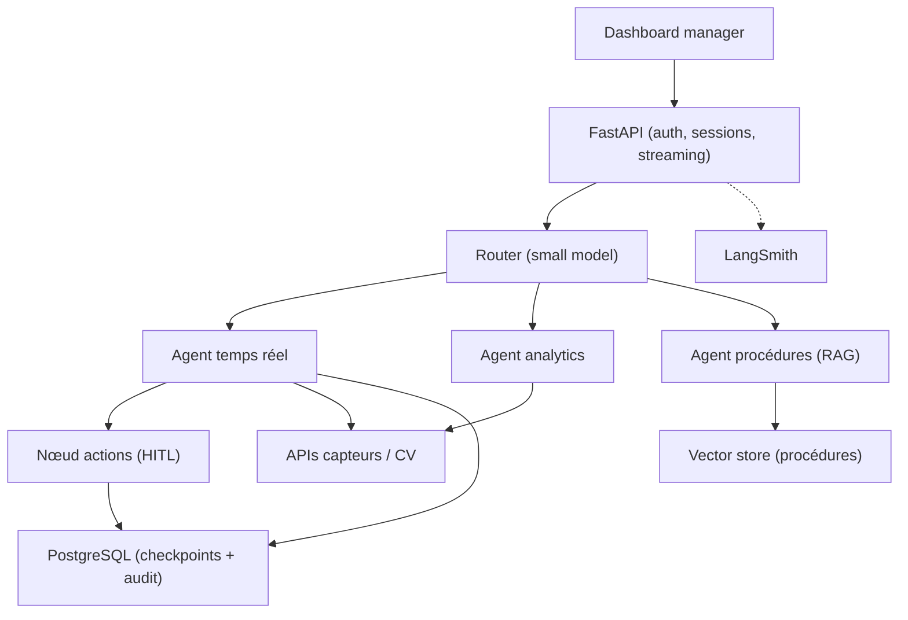

[← Retour au sommaire](../AGentBOOK.md)

## Partie XVI — Projet final

### Chapitre 27 — Architecture du projet

Construction progressive d'un système agentique complet : un **assistant de supervision retail** qui répond aux questions des managers de magasin, analyse les données d'occupation et déclenche des actions encadrées. Chaque section réutilise les briques des chapitres précédents.

#### 27.1 Cahier des charges

Fonctionnalités attendues :

1. répondre aux questions sur l'état du site (occupation, files, bruit) en temps quasi réel ;
2. analyser des historiques et produire des recommandations (réagencement, staffing) ;
3. répondre aux questions sur les procédures internes (RAG documentaire) ;
4. déclencher des actions : notification staff, création de ticket, fermeture de zone (avec approbation) ;
5. conserver le contexte de conversation par utilisateur ;
6. être observable, évaluable, et sécurisé.

Contraintes : latence < 5 s en P95 pour les questions simples, coût < 0,05 $ par requête moyenne, aucune action critique sans validation humaine.

#### 27.2 Architecture globale



#### 27.3 Choix du modèle

Application directe du chapitre 25 :

| Nœud | Modèle | Justification |
|------|--------|---------------|
| Router | gpt-4o-mini | classification simple, volume élevé |
| Agent temps réel | gpt-4o-mini → gpt-4o si sévérité haute | escalade conditionnelle |
| Agent analytics | gpt-4o | raisonnement multi-étapes |
| Agent procédures | gpt-4o-mini | RAG factuel |
| Juge d'évaluation | gpt-4o | fiabilité du jugement |

#### 27.4 Définition des tools

```python
from langchain_core.tools import tool


@tool
def get_zone_status(zone_id: str) -> str:
    """État temps réel d'une zone : occupation, bruit, files, alertes."""
    ...


@tool
def get_site_analytics(site_id: str, period: str, metric: str) -> str:
    """Agrégats historiques d'un site : fréquentation, conversion, pics."""
    ...


@tool
def search_procedures(query: str) -> str:
    """Recherche dans la base documentaire des procédures internes."""
    ...


@tool
def notify_staff(zone_id: str, message: str) -> str:
    """Notifie le staff d'une zone. Action réelle — permission requise."""
    ...


@tool
def create_ticket(title: str, description: str, priority: str) -> str:
    """Crée un ticket d'intervention (maintenance, sécurité, propreté)."""
    ...
```

Chaque tool : docstring précise, arguments typés, résultats bornés en taille, permissions vérifiées en interne (26.4).

#### 27.5 Définition du state

```python
from operator import add
from typing import Annotated, Optional, TypedDict

from langgraph.graph import MessagesState


class SupervisionState(MessagesState):
    """State global de l'assistant de supervision."""

    site_id: str
    route: str
    routing_confidence: float
    alert_severity: Optional[str]
    retrieved_docs: Annotated[list[dict], add]
    pending_action: Optional[dict]
    action_approved: Optional[bool]
```

Le state ne contient que ce qui doit survivre entre les nœuds ; les données volumineuses (frames, séries brutes) restent hors state, référencées par identifiant.

#### 27.6 Construction du graphe

```python
from langgraph.graph import END, START, StateGraph

builder = StateGraph(SupervisionState)

builder.add_node("router", classify_request)
builder.add_node("realtime_agent", realtime_agent_node)
builder.add_node("analytics_agent", analytics_agent_node)
builder.add_node("procedures_agent", procedures_agent_node)
builder.add_node("action_gate", action_gate_node)

builder.add_edge(START, "router")
builder.add_conditional_edges(
    "router",
    route_request,
    {
        "realtime": "realtime_agent",
        "analytics": "analytics_agent",
        "procedures": "procedures_agent",
    },
)
builder.add_conditional_edges(
    "realtime_agent",
    lambda s: "action_gate" if s.get("pending_action") else END,
    {"action_gate": "action_gate", END: END},
)
builder.add_edge("analytics_agent", END)
builder.add_edge("procedures_agent", END)
builder.add_edge("action_gate", END)
```

#### 27.7 Ajout du RAG

L'agent procédures suit le pipeline du chapitre 11 : ingestion des documents internes (procédures d'évacuation, consignes d'hygiène, protocoles incidents), chunking par section, embeddings, retrieval top-5 avec re-ranking, citations obligatoires dans la réponse.

```python
def procedures_agent_node(state: SupervisionState) -> dict:
    """Répond aux questions de procédure avec citations."""
    question = state["messages"][-1].content
    docs = retriever.invoke(question)

    context = "\n\n".join(
        f"[{d.metadata['source']} §{d.metadata['section']}]\n{d.page_content}"
        for d in docs
    )
    answer = model.invoke(
        f"Contexte (procédures internes) :\n{context}\n\n"
        f"Question : {question}\n"
        "Réponds uniquement à partir du contexte et cite tes sources. "
        "Si l'information est absente, dis-le explicitement."
    )
    return {"messages": [answer], "retrieved_docs": [d.metadata for d in docs]}
```

#### 27.8 Ajout de la mémoire

Deux mémoires distinctes (chapitre 16) :

- **court terme** : l'historique de messages du thread, tronqué à 4 000 tokens (`trim_messages`) ;
- **long terme** : préférences du manager (zones favorites, format de rapport préféré) stockées via le Store LangGraph, injectées dans le system prompt à chaque session.

#### 27.9 Persistence

Checkpointer PostgreSQL (chapitre 17) : chaque conversation est un thread persistant, les interruptions HITL survivent aux redémarrages, et le time-travel permet de rejouer un incident pour analyse.

```python
from langgraph.checkpoint.postgres.aio import AsyncPostgresSaver

async with AsyncPostgresSaver.from_conn_string(DATABASE_URL) as saver:
    await saver.setup()
    graph = builder.compile(checkpointer=saver)
```

#### 27.10 Human-in-the-loop

Le nœud `action_gate` applique le chapitre 18 : toute action réelle est interrompue pour approbation.

```python
from langgraph.types import interrupt


def action_gate_node(state: SupervisionState) -> dict:
    """Suspend le graphe jusqu'à validation humaine de l'action."""
    action = state["pending_action"]

    decision = interrupt(
        {
            "type": "approval_request",
            "action": action,
            "justification": state["messages"][-1].content,
        }
    )

    if decision["approved"]:
        result = execute_action(action)
        return {"action_approved": True, "messages": [("ai", result)]}
    return {
        "action_approved": False,
        "messages": [("ai", f"Action annulée : {decision.get('reason', '')}")],
    }
```

#### 27.11 Observabilité

Application du chapitre 22 : tracing LangSmith sur tout le graphe, tags par site et par route, dashboards de latence P95, tokens et coût par requête, alerte si le coût moyen journalier dévie de plus de 30%.

#### 27.12 Evaluation

Application du chapitre 23 :

- golden dataset de 120 exemples (40 temps réel, 40 analytics, 40 procédures) ;
- évaluateurs : tool correct, mentions obligatoires, efficacité de trajectoire, juge LLM pour la qualité des recommandations ;
- gate CI : régression > 5% sur un évaluateur = merge bloqué ;
- évaluation continue sur 5% du trafic production.

#### 27.13 API FastAPI

Application du chapitre 24 : endpoints `/chat` et `/chat/stream`, endpoint `/actions/{id}/approve` pour reprendre les interruptions HITL, authentification JWT, autorisation par site dans les tools, rate limiting par organisation.

```python
from langgraph.types import Command


@app.post("/actions/{thread_id}/approve")
async def approve_action(thread_id: str, approved: bool, request: Request):
    """Reprend une exécution interrompue avec la décision humaine."""
    graph = request.app.state.graph
    config = {"configurable": {"thread_id": thread_id}}

    result = await graph.ainvoke(
        Command(resume={"approved": approved}),
        config=config,
    )
    return {"answer": result["messages"][-1].content}
```

#### 27.14 Tests

Pyramide de tests :

1. **unitaires** : tools (avec APIs mockées), validation, reducers de state ;
2. **intégration** : graphe complet avec un faux LLM déterministe (`FakeListChatModel`) pour tester le routing et les chemins ;
3. **évaluation** : golden dataset avec le vrai modèle (CI nightly, pas à chaque commit) ;
4. **end-to-end** : API + base de données en environnement de staging.

```python
def test_router_directs_realtime_questions() -> None:
    """Le routing envoie les questions temps réel au bon agent."""
    state = {"messages": [("user", "Quelle est l'occupation de la zone caisse ?")]}
    result = classify_request(state)
    assert result["route"] == "realtime"
```

#### 27.15 Déploiement

- conteneur Docker unique (API + graphe), scaling horizontal derrière un load balancer — possible car le state vit dans PostgreSQL ;
- migrations de schéma versionnées (checkpointer + audit) ;
- déploiement progressif : canary sur 10% du trafic avec comparaison des métriques d'évaluation continue ;
- rollback automatique si le taux d'erreur ou le coût moyen dévie ;
- kill switch des tools d'action activable sans redéploiement (configuration).

---

## 🎯 Questions Challenge

> **Question 1** : Le cahier des charges impose 5 s en P95. Quel budget latence attribues-tu à chaque nœud du graphe et quels mécanismes garantissent son respect ?
> **Question 2** : Comment testerais-tu le nœud `action_gate` sans déclencher de vraies notifications ?
> **Question 3** : Quelles données du projet doivent être purgées ou anonymisées pour la conformité RGPD, et où vivent-elles dans l'architecture ?
