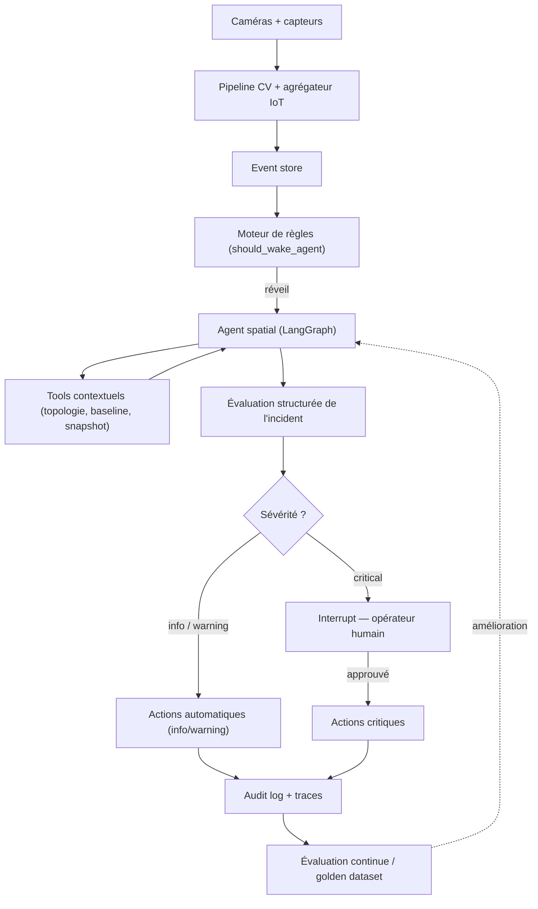

[← Retour au sommaire](../AGentBOOK.md)

## Partie XVII — Projet avancé : Agent autonome multimodal

### Chapitre 28 — Construire un agent de Spatial Intelligence

Projet de synthèse : un agent **autonome** (déclenché par les événements, pas par un humain) qui surveille un espace physique — centre commercial ou place urbaine — fusionne CV, capteurs et données spatiales, raisonne, et agit sous contrôle humain.

#### 28.1 Problème métier

Un gestionnaire d'espace (retail ou collectivité) veut détecter et traiter automatiquement :

- les **congestions** (files, goulots d'étranglement, quais bondés) ;
- les **incidents de sécurité** (chute, mouvement de foule, intrusion en zone fermée) ;
- les **anomalies d'exploitation** (zone anormalement vide, équipement obstrué).

L'agent doit produire des décisions **explicables** : chaque action cite les signaux qui la justifient.

#### 28.2 Acquisition des données

| Source | Protocole | Fréquence | Volume |
|--------|-----------|-----------|--------|
| Caméras | RTSP → pipeline CV | 10–25 fps | élevé (jamais envoyé au LLM) |
| Compteurs de passage | MQTT | 1/min | faible |
| Sonomètres | MQTT | 1/10 s | faible |
| Environnement (CO2, T°) | MQTT | 1/min | faible |
| Plan du site (zones, graphe de circulation) | statique (GeoJSON) | — | faible |

Tout converge vers un **event store** normalisé : chaque événement porte `zone_id`, `timestamp`, `modality`, `payload`.

#### 28.3 Computer Vision

Le pipeline CV tourne en continu, hors LLM : détection de personnes (YOLO), tracking multi-objets (identifiants persistants), pose estimation pour les postures. Il n'émet que des **événements symboliques** :

```python
from pydantic import BaseModel


class CVEvent(BaseModel):
    """Événement symbolique émis par le pipeline CV."""

    event_type: str  # "crowd_density", "fall_detected", "zone_intrusion"
    zone_id: str
    timestamp: str
    confidence: float
    details: dict  # ex : {"person_count": 47, "density": 0.91}
```

#### 28.4 Détection d'événements

Un moteur de règles déterministe filtre le bruit avant de réveiller l'agent :

```python
def should_wake_agent(event: CVEvent, recent_events: list[CVEvent]) -> bool:
    """Décide si un événement justifie une analyse par l'agent."""
    if event.event_type == "fall_detected" and event.confidence > 0.75:
        return True
    if event.event_type == "crowd_density" and event.details["density"] > 0.85:
        # Densité élevée persistante (3 événements en 5 min)
        similar = [
            e
            for e in recent_events
            if e.event_type == "crowd_density" and e.zone_id == event.zone_id
        ]
        return len(similar) >= 3
    return False
```

Principe : l'agent (coûteux) ne traite que les situations ambiguës ou critiques ; les cas triviaux sont traités par des règles.

#### 28.5 Données spatiales

Le plan du site est un **graphe de zones** : l'agent raisonne sur la topologie (zones adjacentes, issues, capacités) pour évaluer la propagation d'une congestion et proposer des reroutages.

```python
SITE_GRAPH = {
    "entree_nord": {"adjacent": ["hall_central"], "capacity": 200, "exits": 2},
    "hall_central": {
        "adjacent": ["entree_nord", "zone_commerces", "quai_transport"],
        "capacity": 800,
        "exits": 4,
    },
    "quai_transport": {"adjacent": ["hall_central"], "capacity": 350, "exits": 1},
}


@tool
def get_zone_topology(zone_id: str) -> str:
    """Topologie d'une zone : zones adjacentes, capacité, issues."""
    zone = SITE_GRAPH.get(zone_id)
    if zone is None:
        return f"Zone inconnue : {zone_id}"
    return (
        f"Zone {zone_id} — capacité {zone['capacity']} pers., "
        f"{zone['exits']} issue(s), adjacente à : {', '.join(zone['adjacent'])}."
    )
```

#### 28.6 Données temporelles

L'agent compare toujours l'instant présent aux **profils historiques** : 500 personnes dans le hall à 18 h un vendredi est normal ; à 3 h du matin c'est une anomalie majeure.

```python
@tool
def get_baseline(zone_id: str, weekday: str, hour: int) -> str:
    """Profil historique d'occupation d'une zone (médiane et P90)."""
    profile = baseline_store.lookup(zone_id, weekday, hour)
    return (
        f"Zone {zone_id}, {weekday} {hour}h — médiane : {profile.median} pers., "
        f"P90 : {profile.p90} pers."
    )
```

#### 28.7 Capteurs

Les capteurs complètent la CV avec des mesures que la vision ne donne pas (bruit, CO2 comme proxy de densité en zone non couverte par caméra). L'agrégateur du 21.8 fournit des fenêtres de 5 minutes avec comparaison automatique aux seuils.

#### 28.8 State spatial

```python
from operator import add
from typing import Annotated, Optional, TypedDict


class SpatialState(TypedDict):
    """State de l'agent de spatial intelligence."""

    site_id: str
    trigger_event: dict
    zone_snapshots: Annotated[list[dict], add]
    topology_context: Optional[str]
    baseline_context: Optional[str]
    incident_assessment: Optional[dict]
    proposed_actions: list[dict]
    executed_actions: Annotated[list[dict], add]
    requires_human: bool
```

Le state porte l'**évaluation en cours d'un incident**, pas l'état du site entier (qui vit dans l'event store).

#### 28.9 Raisonnement de l'agent

L'agent suit un protocole d'investigation imposé par son prompt :

```python
SPATIAL_AGENT_PROMPT = """
Tu es un agent de spatial intelligence supervisant {site_name}.
Tu es réveillé par un événement. Protocole obligatoire :

1. CONTEXTUALISER : récupère l'état de la zone concernée et des zones adjacentes.
2. COMPARER : confronte la situation au profil historique (baseline).
3. CORRÉLER : vérifie si d'autres modalités confirment le signal.
4. ÉVALUER : classe l'incident (info / warning / critical) en citant chaque preuve.
5. AGIR : propose des actions proportionnées. Toute action critique
   nécessite une approbation humaine — ne tente jamais de la contourner.

Tu ne conclus jamais à partir d'une seule source. En cas de doute, tu
escalades vers un humain plutôt que d'agir.
"""
```

Sortie structurée de l'évaluation :

```python
from typing import Literal

from pydantic import BaseModel, Field


class IncidentAssessment(BaseModel):
    """Évaluation structurée d'un incident."""

    severity: Literal["info", "warning", "critical"]
    incident_type: str
    affected_zones: list[str]
    evidence: list[str] = Field(description="Signaux justifiant l'évaluation")
    recommended_actions: list[str]
    confidence: float = Field(ge=0.0, le=1.0)
```

#### 28.10 Sélection dynamique des tools

L'agent ne reçoit que les tools pertinents pour le type d'événement, ce qui réduit les erreurs de sélection et le coût :

```python
TOOLSETS = {
    "fall_detected": [get_camera_snapshot, get_zone_topology, notify_security],
    "crowd_density": [
        get_zone_topology,
        get_baseline,
        get_sensor_summary,
        update_signage,
        notify_staff,
    ],
    "zone_intrusion": [get_camera_snapshot, get_zone_topology, notify_security],
}


def build_agent_for_event(event_type: str):
    """Instancie l'agent avec le toolset adapté à l'événement."""
    tools = TOOLSETS.get(event_type, [get_zone_topology, get_baseline])
    return create_react_agent(
        model="openai:gpt-4o",
        tools=tools,
        prompt=SPATIAL_AGENT_PROMPT,
    )
```

#### 28.11 Déclenchement d'actions

Les actions sont graduées et proportionnées à la sévérité :

| Sévérité | Actions autorisées | Validation |
|----------|--------------------|------------|
| info | journalisation, annotation du dashboard | automatique |
| warning | notification staff, mise à jour signalétique | automatique + audit |
| critical | appel sécurité, fermeture de zone, annonce sonore | humaine obligatoire |

#### 28.12 Human-in-the-loop

```python
from langgraph.types import interrupt


def action_execution_node(state: SpatialState) -> dict:
    """Exécute les actions, avec interruption pour les cas critiques."""
    assessment = state["incident_assessment"]
    executed = []

    for action in state["proposed_actions"]:
        if assessment["severity"] == "critical" or action["irreversible"]:
            decision = interrupt(
                {
                    "action": action,
                    "assessment": assessment,
                    "evidence": assessment["evidence"],
                }
            )
            if not decision["approved"]:
                continue
        executed.append(execute_action(action))

    return {"executed_actions": executed}
```

L'opérateur reçoit l'action proposée **avec les preuves**, décide en connaissance de cause, et sa décision est journalisée.

#### 28.13 Journalisation des décisions

Chaque cycle de décision produit un enregistrement d'audit complet et immuable :

```python
class DecisionRecord(BaseModel):
    """Enregistrement d'audit d'une décision de l'agent."""

    incident_id: str
    trigger_event: dict
    assessment: IncidentAssessment
    tools_called: list[dict]
    actions_proposed: list[dict]
    actions_executed: list[dict]
    human_decisions: list[dict]
    trace_id: str
    model_used: str
    total_cost_usd: float
    timestamp: str
```

Ces enregistrements servent trois usages : conformité (qui a décidé quoi), amélioration (les incidents mal gérés alimentent le golden dataset), et confiance (les opérateurs peuvent rejouer le raisonnement).

#### 28.14 Architecture complète



Ce projet condense tout le livre : pré-traitement déterministe (Partie XIII), agent LangGraph avec state dédié (Parties VIII–X), human-in-the-loop (Partie XI), tools sécurisés et audités (Partie XV), observabilité et amélioration continue (Partie XIV). Le LLM n'est ni le point d'entrée ni le décideur final : il est le **moteur de raisonnement** au centre d'une architecture qui l'encadre.

---

## 🎯 Questions Challenge

> **Question 1** : Pourquoi placer un moteur de règles déterministe entre l'event store et l'agent ? Que se passerait-il sans lui ?
> **Question 2** : L'agent propose de fermer le quai transport suite à une densité de 0.92. Quelles preuves minimales l'opérateur doit-il recevoir pour décider, et d'où viennent-elles dans l'architecture ?
> **Question 3** : Adapte cette architecture à un cas d'urbanisme : gestion des flux piétons autour d'un stade les soirs de match. Qu'est-ce qui change (sources, zones, actions, acteurs humains) ?
